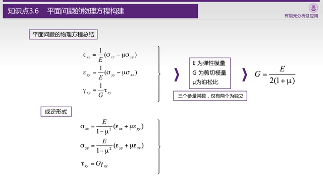

# 3. 针对复杂几何形状变形体的力学描述（1）

## 前言

* 3.1 力学描述的基本思路及关于变形体材料的基本假设
* 3.2 指标记法
* 3.3 关于三大变量及三大方程的思路

这一讲主要是针对复杂形状的弹性体进行建模，这里的例子用的是二维平面，为了单位的合理所以强行加了一个厚度t，在之后的计算中基本都被约掉了。 不考虑三维可以理解，毕竟阐述建模思想就可以了，三维的话光记住所有的应力就够费脑子了。

首先前面的部分主要是回顾和引入，从这里开始：

其实大多数的材料都不完全满足这五个特性。 就比较熟悉的钢铁来说，铸造的物体可能有沙眼气泡，锻造的物体根据锻造的时候的受压情况，并不是各向同性的，焊接的还会有内应力，但是计算机要的就是简化。

然后针对确认不满足这五个情况的其实有一些其他的理论解决，但是这些不在讨论之列。

指标记法主要是对于如何缩写一些求和表达式的约定。 这里有一小半时间都在介绍指标记法和Voigt，看上去写的是简单了，但是约定一大堆，我个人觉得至少不利于我的学习和理解。

建模的思路很简单，老师总结为三大变量（应力、应变、位移），三大方程（力平衡，变形协调，物理（广义胡克定律）），约束。

从顺序上理解的话：

* （切割）把复杂零件切割为小方块（边界上是小三角块）
* （应力）针对小方块的受力情况，构建力的平衡方程。
* （应变）针对变形，施加约束条件，使得变形不能撕裂或者重叠
* （应力和应变关系）考虑弹性模量和泊松比，构建应力和应变的关系
* （边界）针对边界，考虑两种情况，力约束和位移约束
  * 位移约束就是控制位移，没毛病
  * 力约束的话针对小三角块构建力的平衡方程

## 3.4 平面问题的平衡方程构建

平衡方程主要考虑：x方向，y方向，力矩。

物理上理解，如果这个微元受力不平衡，就会产生加速度或者角加速度，最后就是飞起来或者转起来。

做静态分析的时候，这明显是不靠谱的，零件会飞走的，所以应该是合力为0。

分析的时候会有一个问题，按道理说，左右两边（或者上下）的应力应该是相等的，但是并不是，相等意味着导数为0，意味着受力完全均匀分布，这个明显不符合实际情况。

所以我们考虑在这个地方用泰勒展开，然后用一阶项去近似这个增量。

在x方向除了有正应力（的差分），还有剪切应力（的差分），上下面受剪切应力不一样的时候，也会产生x方向的力，但是由于上下面的差分，所以这里对y求偏导。

最后的最后，我们发现 $$dxdyt$$ 作为公共项约掉了，最后考虑一下和体积力（重力/电磁力等）平衡即可。 y方向也如法炮制。

最后是剪切应力，思路是类似的，但是结论稍有不同，最后得到 $$\tau_{xy}=\tau_{yx}$$，这个其实也不难理解，正应力抵消了，又没有“体积扭矩”这种东西，如果剪切应力不一样的话单元直接得转起来了。

最后看一下结论：

结论还是简洁的，一言以蔽之，应力抵消体积力。

## 3.5 平面问题的几何方程构建

对于x和y来说，应变即位移的偏导数，这个哪怕没有几何图形也可以直观理解。

对于剪切力引起的应变，采用$$\alpha + \beta$$的方式定义，也就是图里变形以后的尖角和90度的差值。

需要注意的是，这里的角度都是用$$tan(\alpha) + tan(\beta)$$代替的，主要还是因为角度太小了，可以不考虑非线性的tan函数。

这里是几何方程和指标记法，说实话，约定b我觉得牵强了点……

满足\[变形协调条件]\([https://en.wikipedia.org/wiki/Compatibility\_(mechanics))才能说这个位移场是一个物理上有效的位移场，因为在这里的分析中，材料不会撕裂，更不会重叠，一定是连续的。](https://en.wikipedia.org/wiki/Compatibility\_\(mechanics\)\)%E6%89%8D%E8%83%BD%E8%AF%B4%E8%BF%99%E4%B8%AA%E4%BD%8D%E7%A7%BB%E5%9C%BA%E6%98%AF%E4%B8%80%E4%B8%AA%E7%89%A9%E7%90%86%E4%B8%8A%E6%9C%89%E6%95%88%E7%9A%84%E4%BD%8D%E7%A7%BB%E5%9C%BA%EF%BC%8C%E5%9B%A0%E4%B8%BA%E5%9C%A8%E8%BF%99%E9%87%8C%E7%9A%84%E5%88%86%E6%9E%90%E4%B8%AD%EF%BC%8C%E6%9D%90%E6%96%99%E4%B8%8D%E4%BC%9A%E6%92%95%E8%A3%82%EF%BC%8C%E6%9B%B4%E4%B8%8D%E4%BC%9A%E9%87%8D%E5%8F%A0%EF%BC%8C%E4%B8%80%E5%AE%9A%E6%98%AF%E8%BF%9E%E7%BB%AD%E7%9A%84%E3%80%82)

说实话我没法从直观上理解这个方程，只能从数学上理解，如果每一个单元都按照第一章图画的那样变形（矩形变菱形），我们可以从位移推导出三个应变量的公式，但是2个数值映射到3个数值，一定有一个数值是多余的，这个就是切应变（当然也可以是其它的，只不过我觉得切应变孤单好欺负）。

于是可以从数学上，构造出正应变和切应变在二阶偏导数上的关系。

## 3.6 平面问题的物理方程构建

学材料力学的时候，我们知道除了杨氏（弹性）模量，还有一个泊松比，正泊松比的材料越拉越窄（这个符合常识），负泊松比的材料越拉越宽。

这里就开始把应力和应变串到一起了。

多出来的剪切模量可以用泊松比和弹性模量求出，最后我们就可以求得应力和应变的互换公式（材料需要指定）。

后面指标记法和Voigt规则的部分略。

## 3.7 两类边界条件

边界是特殊的单元，其实边界有两种，受力（受力为0算特殊的受力）和（位置）固定。

这里用偏导符号表示物体的边界（三维则是封闭曲面），受力约束和位置约束需要不重不漏的覆盖所有边界。

针对三角形的小单元构建力和力矩的平衡方程，需要考虑斜边的方向余弦。

最后得出结论，除了剪应力需要相等以外，剪应力加正应力需要抵消相应方向上的外力。考虑到外力为0其实是挺常见的边界条件，所以这里我们可以看到剪应力和正应力的互相转换。

 
