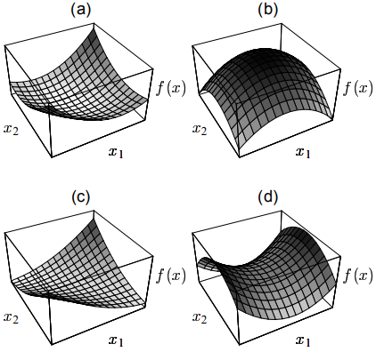
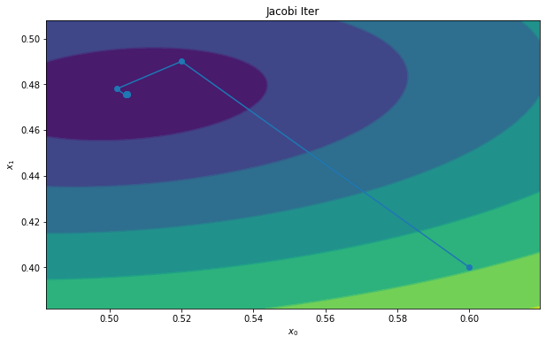
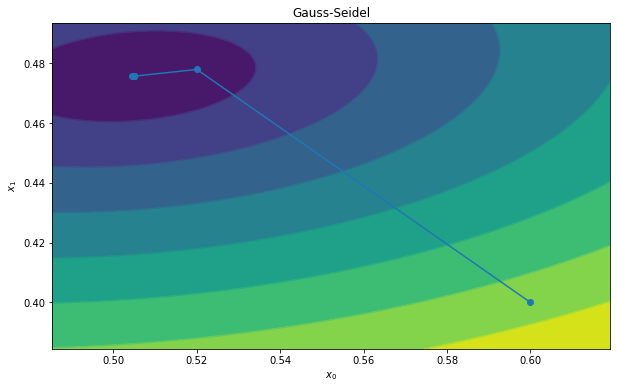
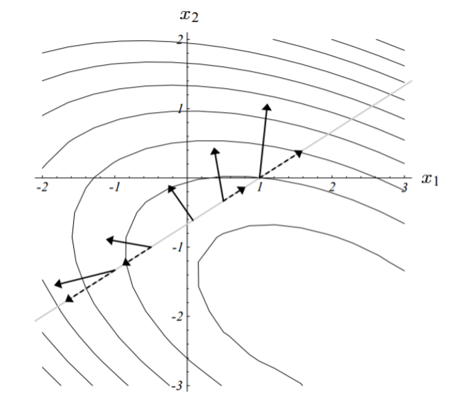
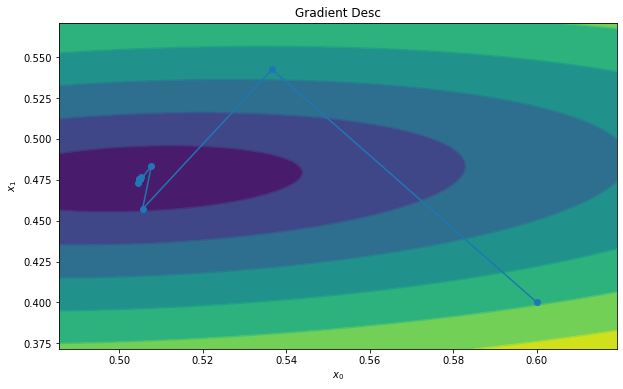

# 专题：线性方程组求解

## 简介

这里完整介绍一些求 $$\bold{A}\vec{x}=\vec{b}$$ 的方法，特点是A矩阵的规模比较大。 正常来说，求解线性方程组可以通过求逆矩阵，高斯消元，克拉默法则（~~大学线代第一节课就学这个没用的东西，不会真的有人用吧，不会吧不会吧~~）等等方式去求解。 但是A很大的时候这个方法就失效了，这个时候一般用迭代法，本文以介绍迭代法为主。

这里解的方程组一定要正定，负定的矩阵解起来注定是失稳的。如果是正半定，或者说奇异矩阵（存在为0的特征值），那么解将会在某个子空间里而不唯一。

其实从二次型的视角就很容易看出：



（请注意，本文中的推导仅仅是验证实验用，性能并非最优）

## Jacobi 迭代与 Gauss-Seidel

### Jacobi 迭代

推导过程：

* 我们把A矩阵分尸三块：$$A = D - L - U$$
  * 其中，D是对角线，L是上三角取负，U是下三角取负。
* 这样，$$Ax=b$$ 就可以写成 $$(D-L-U)x=b$$&#x20;
* 移动一下：$$Dx=(L+U)x + b$$&#x20;
* 由于D是对角矩阵，可无成本求逆：$$x=D^{-1}(L+U)x+D^{-1}b$$&#x20;

于是我们利用下列公式迭代更新：

$$
x^{(k+1)} = D^{-1}(L+U)x^{(k)} + D^{-1}b
$$

即可求得解，至于为什么是这样，可看收敛性分析。

%accordion% Numpy实现 %accordion%

```python
def jacobi_iteration(A,b,init_x,iters=10):
    dim = init_x.shape[0]
    x = init_x
    result = np.zeros((iters+1,dim))
    result[0,:] = x.reshape(-1)

    diag_A = np.diag(A)
    D_inv = np.diag(1.0/diag_A)
    LU = np.diag(diag_A) - A
    B = D_inv @ LU
    D_inv_b = D_inv @ b

    for i in range(iters):
        x = B @ x + D_inv_b
        result[i+1,:] = x.reshape(-1)
    return result
```

%/accordion%



### Gauss-Seidel

Jacobi迭代中，$$x^{(k+1)} = D^{-1}(L+U)x^{(k)} + D^{-1}b$$， 这里的 $$x^{(k+1)}$$是向量，Jacobi迭代更新的时候是并行更新的。 但是Gauss-Seidel则是一个个元素更新的。

更新$$x^{(k+1)}_{1}$$的时候会用到$$x^{(k+1)}_{0}$$，同理，更新$$x^{(k+1)}_{2}$$的时候会用到$$x^{(k+1)}_{0}$$和$$x^{(k+1)}_{1}$$。

（然而并没什么卵用，不必Jacobi快多少，还不能并行计算了。。。）

%accordion% Numpy实现 %accordion%

```python
def gauss_seidel_iteration(A,b,init_x,iters=10):
    dim = init_x.shape[0]
    x = init_x
    result = np.zeros((iters+1,dim))
    result[0,:] = x.reshape(-1)

    diag_A = np.diag(A)
    D_inv = np.diag(1.0/diag_A)
    LU = np.diag(diag_A) - A
    B = D_inv @ LU
    D_inv_b = D_inv @ b

    for i in range(iters):
        for d in range(dim):
            x[d] = B[d,:] @ x + D_inv_b[d]
        result[i+1,:] = x.reshape(-1)
    return result
```

%/accordion%



### 收敛性分析

如果矩阵A每一行的“除了对角线元素之外，其它元素的和”都要小于对角线元素的话，则这个矩阵一定可以被Jacobi迭代求解（我也不知为何如此，不过应该可以从这个条件推出谱半径小于1）。

还有一个就是B矩阵 （$$B=D^{-1}(L+U)$$） 的谱半径，谱半径等于最大的特征值。每个向量都可以被分解为特征向量的和（也就是表达在某个以特征向量为基的空间），如果谱半径大于1，那么求解的时候就会发散。谱半径不仅要小于1，而且要越小越好，这样收敛才够迅速。

而为什么我们关心B的谱半径呢？

我们站在神的视角，已经知道了真实的解x，也就是说x绝对满足： $$x=Bx + D^{-1}b$$，那么不妨设置误差 $$e^{(k)} = x^{(k)} - x$$

每一次迭代的时候，我们看作：$$e^{(k+1)} + x = B(e^{(k)}+x) + D^{-1}b$$

所以有：$$e^{(k+1)} + x = Bx + D^{-1}b + Be^{(k)}$$

我们知道 $$x = Bx + D^{-1}b$$ 所以消去等号两侧的两项，得到：

$$e^{(k+1)} = Be^{(k)}$$

所以，很直观的看到，只有谱半径小于1，才能保证误差不断减少，即所谓收敛。

## 梯度下降

梯度下降迭代法的思路是优化 $$x = argmin_z \| Az - b \|$$

所以Loss Function就是 $$L = x^TAx - b^Tx$$

$$
\frac{\partial{L}}{\partial{x}}=Ax-b
$$

梯度方向有了，下面就是学习率了，和机器学习任务不一样，这里的学习率是可以有最优解的， 原理大概是如果沿着梯度方向前后走，并且记录路径上L的大小，那么我们会得到一个抛物线，抛物线是有极小值的啊！！！！

$$
\frac{\partial}{\partial{\alpha}} (f(\alpha)^TAf(\alpha)-b^Tf(\alpha)) = 0
$$

其中 $$f(\alpha) = x - \alpha (Ax-b)$$

或者说，走到新的点以后，其梯度应该和当前的梯度正交，这两种表述是等价的：



最优解是：

$$
\alpha = \frac{x^Tx}{x^TAx}
$$

过程太难打暂略。

根据这个性质，梯度下降的算法将会以互相垂直的折线路径快速逼近最优解。

%accordion% Numpy实现 %accordion%

```python
def gradient_desc(A,b,init_x,iters=10):
    dim = init_x.shape[0]
    x = init_x
    result = np.zeros((iters+1,dim))
    result[0,:] = x.reshape(-1)
    for i in range(iters):
        ax = A @ x
        grad = ax - b
        flat_x = x.reshape(-1)
        lr = np.dot(flat_x,flat_x)/np.dot(ax.reshape(-1),flat_x)
        x -= grad * lr
        result[i+1,:] = x.reshape(-1)
    return result
```

%/accordion%



## 共轭梯度法

这个方法的思路是，不走回头路，如果我每一次新的搜索空间都和之前的所有搜索空间正交，那么可以更加高效。

但是求出一个正交的子空间（比如用施密特正交）复杂度他娘的是 $$O(n^3)$$ 啊。

## Warm Start

在解微分方程（组）的时候，由于上一个时间片的状态和这个时间片的状态相差并不多，所以可以用上一个时间片的状态作为这个时间片的初始值输入，这样可以大大增加求解的效率。

## MultiGrid

## References

### 测试代码

%accordion% 测试框架 %accordion%

```python
import numpy as np
from matplotlib import pyplot as plt

def solver_visualizer(A:np.ndarray,b:np.ndarray,x:np.ndarray,steps:int=100):
    """
    A: 2x2 matrix
    b: 2x1 vector
    x: nx2 vectors
    """
    ax_min = x[:,0].min()
    ax_max = x[:,0].max()
    rx = ax_max - ax_min
    ay_min = x[:,1].min()
    ay_max = x[:,1].max()
    ry = ay_max - ay_min
    X,Y = np.meshgrid(
        np.linspace(ax_min - 0.2 * rx,ax_max + 0.2 * rx,steps),
        np.linspace(ay_min - 0.2 * ry,ay_max + 0.2 * ry,steps),
    )
    E = np.linalg.norm(
        A @ np.array([X.reshape(-1),Y.reshape(-1)]) - b, 
        axis=0
    ).reshape(
        X.shape
    )
    plt.figure(figsize=(10,6))
    plt.contourf(X,Y,E)
    plt.contour(X,Y,E)
    plt.plot(x[:,0],x[:,1],'-o')
    plt.show()

A = np.array([[1,0.2],[-0.3,2]])
b = np.array([0.6,0.8]).reshape(2,1)
init_x =  b / np.diag(A).reshape(2,1)

# Example

solver_visualizer(A,b,gauss_seidel_iteration(A,b,init_x,10))
```

%/accordion%

### 参考文献

* [An Introduction to the Conjugate Gradient Method Without the Agonizing Pain](https://www.cs.cmu.edu/\~quake-papers/painless-conjugate-gradient.pdf)
  * [共轭梯度法通俗讲义](https://flat2010.github.io/2018/10/26/%E5%85%B1%E8%BD%AD%E6%A2%AF%E5%BA%A6%E6%B3%95%E9%80%9A%E4%BF%97%E8%AE%B2%E4%B9%89/)

### 软件库收集

* [MKL Sparse Solver Routines](https://software.intel.com/content/www/us/en/develop/documentation/mkl-developer-reference-fortran/top/sparse-solver-routines.html)
* [PARDISO](https://www.pardiso-project.org/)
* [Sparse Matrix Solvers on the GPU: Conjugate Gradients and Multigrid](http://www.cs.jhu.edu/\~misha/ReadingSeminar/Papers/Bolz03.pdf)
* [cuSOLVER](https://docs.nvidia.com/cuda/cusolver/index.html)
