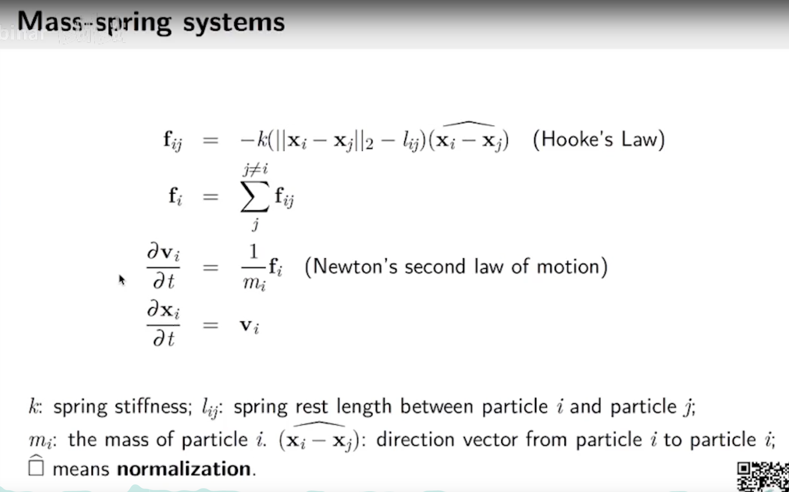
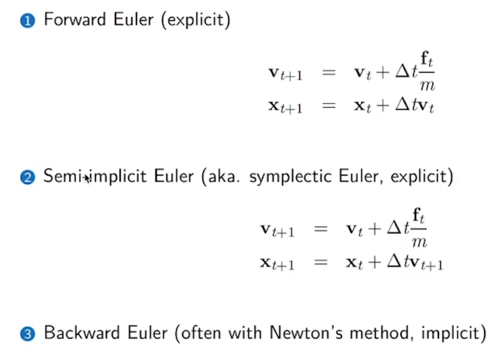
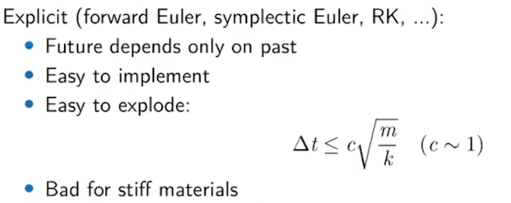
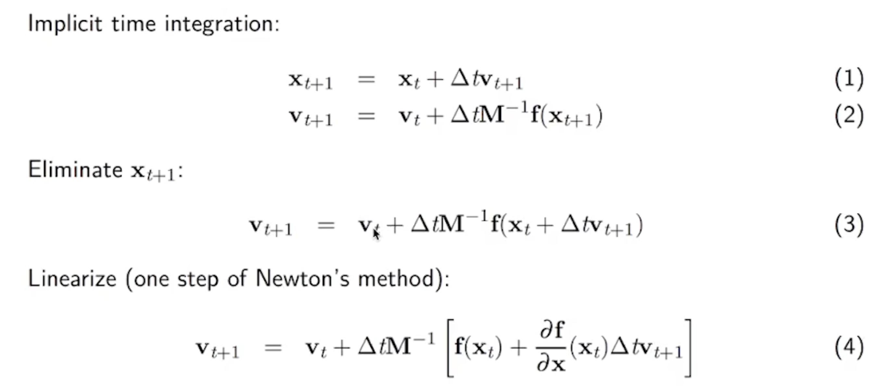
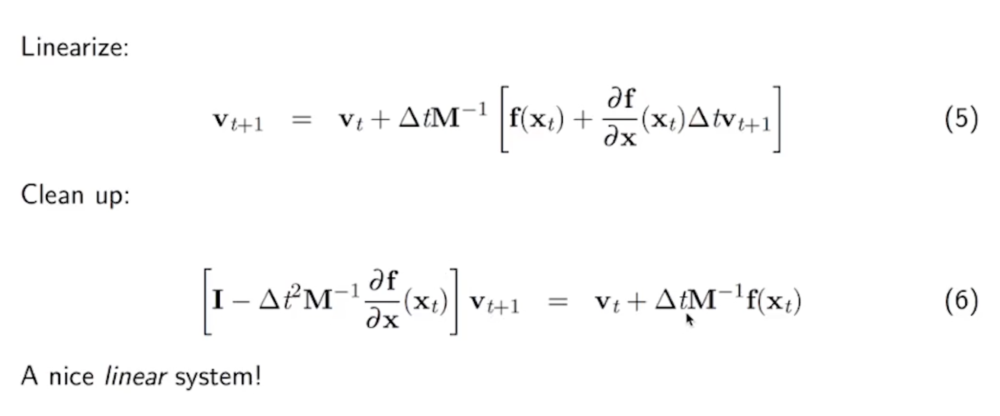
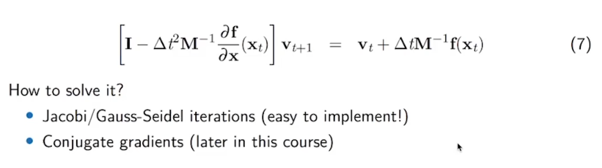
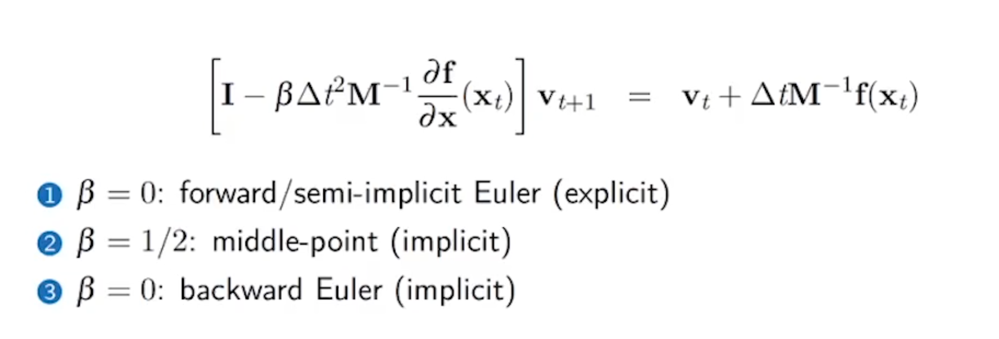
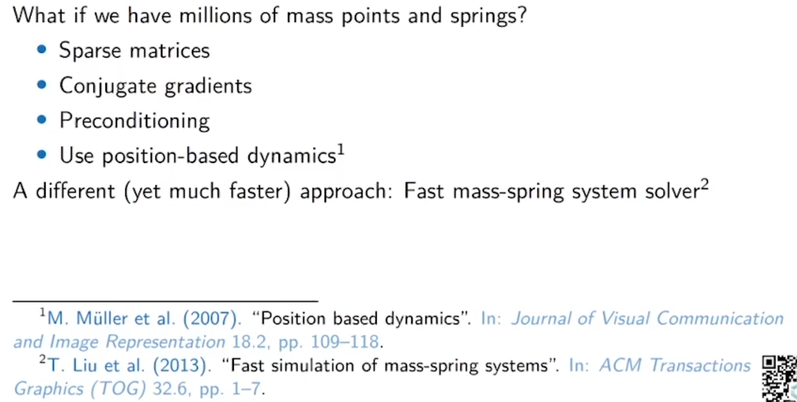

# 弹簧质点系统

## 受力分析

弹簧指点系统遵循胡克定律&牛顿运动定律：



并不复杂（当然需要考虑重力）。

## 时间积分



### 前向欧拉

通过当前的状态推测下一步的状态

* 通过当前的受力分析计算加速度，推断下一步的速度（ $$\times \delta t$$ ）
* 通过当前的速度计算下一步的位移

### 半隐式欧拉 （AKA. Symplectic Euler 对偶欧拉）

* 通过当前的受力分析计算加速度，推断下一步的速度（ $$\times \delta t$$ ）（和上面一样）
* 用计算出来的新速度计算下一步的位移

实现的时候，在更新计算和地面的碰撞的时候，更新位置之前首先计算和地面的碰撞（`pos.y<bottom_height?`），如果碰撞的，把速度设置为0。

上面两种都是显式时间积分器，问题在于对步长有限制，不可太大，否则容易爆炸：



这个公式的原因是：超过了Nyquist采样频率（TODO 找一些文献）

### 后向欧拉

隐式时间积分不止这一种，还有Middle-Point之类。

缺点：

* 难以实现，难以优化
* 每一步都会变得更加昂贵

优点：

* 可以容忍更加大的步长



可以看到，1和2互相依赖，所以代入求解：



按照道理说，求逆矩阵是最好的，但是时间复杂度不可接受，所以我们用雅可比迭代之类的方法替代：



雅可比迭代的一个实现：

```python
@ti.kernel
def iterate():
    for i in range(n):
        r = b[i]
        for j in range(n):
            if i != j:
                r -= A[i, j] * x[j]

        new_x[i] = r / A[i, i]

    for i in range(n):
        x[i] = new_x[i]
```

但是雅可比迭代使用有限制，只能收敛一些性质比较好的矩阵，对谱半径有一些要求。

使用共轭梯度的话就会更快一点。

从这里就可以看出来不同求解器的区别和联系：



### 大规模求解器

（仅仅是索引）



### 实践记录
