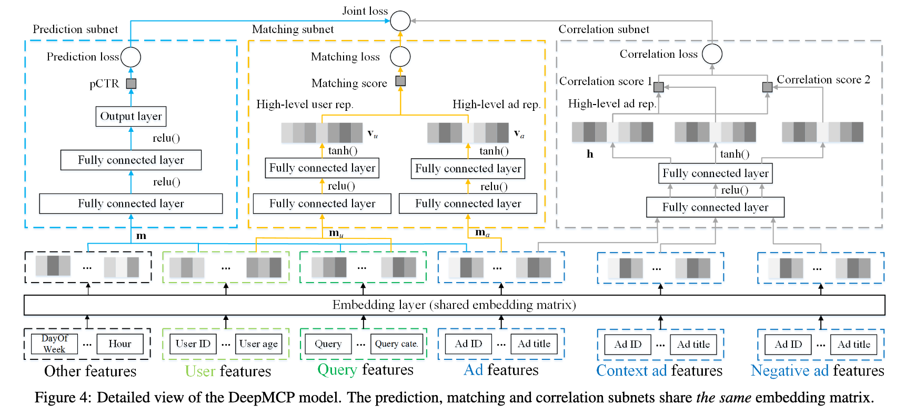

# 再谈正则化项

## 前言

今天是除夕，马上过年了，先给大家拜个早年，感谢大家还没有取关我这个拖更了半年的鸽王。 我们今天要讨论的是（广义的）正则化项，从另一种角度来讨论。 说到正则化，每一个做机器学习的同志都不会陌生。做机器学习的过程需要花上很大的力气和过拟合作斗争。 但是原则上来说，我是不喜欢（狭义的）正则化项，因为不直观，凭什么参数的平方和这种东西会和模型复杂度有关系呢？为什么是平方和不是四次方和呢？或者是绝对值和？ PRML上有一张很有名的图片用可视化的方法说明了正则项的实际意义，但是仍然让我们觉得这样不OK，凭什么这一种正则化方法可以用在这么多的任务上并且保持有效？

## 那咋办？

我的结论就是不要用这种正则化项。或者说，少用。除非你希望参数稀疏的时候来上一个L1的正则化之类的。

如果没有正则化项，我们有什么办法控制模型的复杂度呢？

例如推荐系统，在做嵌入（Embedding）的时候，主动约束Embedding的维度，仅仅用8维到16维就可以表达一个用户，层数也减少，这样的训练就更加漫长了，但是小心翼翼的维持着“卧槽模型复杂度不够导致精度不行”和“卧槽模型复杂度太高训练几步就过拟合了”之间的平衡的话，能拿到一个相当不错的成绩。

## 还有什么别的好办法吗？

其实大家熟知的CNN，就是基于平移不变性假设的权值共享。在CNN之前，我们处理手写数字这样的数据集，是把28\*28的图片直接Flatten的，显然这样的方法或许能工作但是极容易过拟合，如果想要不过拟合，那就要准备好海量的数据。

所以解决方案也就呼之欲出了：**强行让模型符合一定的假设。**

这就是今天，我读了一篇论文：[Representation Learning-Assisted Click-Through Rate Prediction​](https://arxiv.org/abs/1906.04365) 之后的感受。简单的看上去这篇文章和今天的问题没什么关系。容我细细道来。

首先文章定义了一个模型：

这个模型有三个部分，预测，匹配，关联。本质上是可以独立训练的三个网络。 第一个是CTR预估模型，它的长相平平无奇（详情见论文）。 第二个是相似度匹配模型，它讲用户和广告各进行一个变换以后，进行一次内积，通过内积的数值求出相似度，它的相似，本质上就是点击。 第三个网络其实是个伪装的很好的Word2Vec模型（雾）。用于计算广告和广告之间的PY关系。 我讲的比较简单，这位仁兄说的稍微详细些：

[Jesse：（读论文）推荐系统之CTR预估-DMCP模型](https://zhuanlan.zhihu.com/p/102075293)

训练的时候要三个网络一起训练，但是预测的时候只用CTR，这一开始让我无论如何也想不通，如果你的目标是CTR，为什么不让LOSS直接针对CTR进行训练呢？ 其实这另外的两个网络根本就不是要训练的部分，它们只不过是第一个网络的正则化项而已。这里面的一个大前提就是，我底下的这些Embedding，它们应该是能表达用户和广告的，并不仅仅是做预测（这也是Embedding层设计的初衷），这样的设计在早起的NN方法中，会用ALS算法的结果做Embedding层的初始化就可见一斑。但是End2End的方法流行以后，网络并不会在乎人类最初是怎么设计这一层的，网络只关心Loss。 回到这篇文章，我们可以看出，作者本质上假设了，这些Embedding，除了预测CTR以外，理论上也能承担其他任务，例如关联和匹配等等，这些才是Multi Task的本质，其它的Task都是为了某一个具体的Task服务的正则化项，并不是我真的需要这些Task。

如果我们继续回顾，还会有更多细思恐极的细节：

\[Joint Face Detection and Alignment using Multi-task Cascaded Convolutional Networks]​([https://arxiv.org/abs/1604.02878](https://arxiv.org/abs/1604.02878))

这是一篇很早（也还行）的人脸检测的论文，当然，也算是SOTA模型之一了，效果很棒，就是全卷积部分上GPU Batch困难（扯远了）。 其中的P/R-Net，只需要做 Face Classification，就可以了，但是训练的时候仍然加入了boundbox和landmark的相关Loss，本质上，剩下的这俩Loss也是一种正则化。

## 总结

如果我们检视多任务训练的框架，我们就会发现，很少有“我们真的要用这个网络完成好几件事情”的情况，更多的，往往是成为主要目标的约束，防止网络放飞自我而过拟合。
