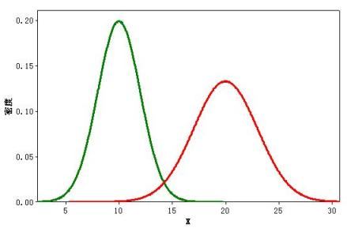
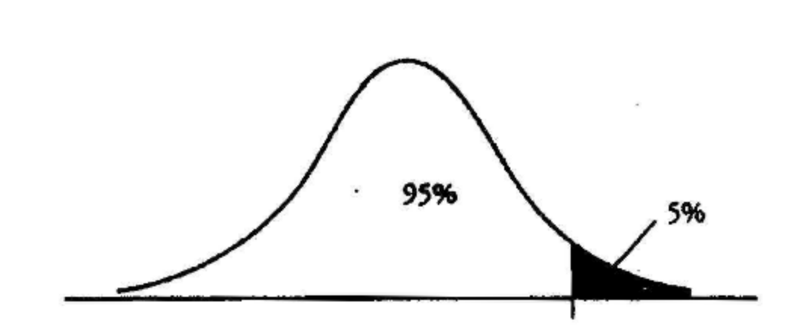

# 关于AA测试和AB测试的一些思考

## 起因

一般的AA/AB测试都怎么做呢？正常来说，取一部分用户，然后把用户分成2组（也可以是多组，本文中我们只讨论最典型的2组的情况），在一段时间的运行以后，比较其结果。

AB测试自不必说，主要测试新的算法在指定的监测指标上又没有达到预期，AA测试则一般用来测试AB测试和用户的稳定性，也可以作为AB测试的一个预演和对AB测试工具的测试。 有了AA测试，可以对AB测试的结果更为自信，当然，也有很多的文章讨论AA测试究竟是不是必要的，例如这一篇：[A/A Testing: A Waste of Time or Useful Best Practice?](https://www.abtasty.com/blog/aa-test-waste-of-time-or-useful-best-practice/)。

就我的实践而言，AB测试中的确容易出现两组天然存在指标差异的情况，尤其是样本或者用户少的时候更容易发生，比如有的时候你就是不幸多分了几个Heavy User到某一个组去，导致你怎么测试都得不到正确的结果……当然，在实践中，这个问题造成的误差并不大，一般CTR误差都在0.1%这个量级，而且误差可以随着时间收敛，基本算法带来的提升都应该能覆盖这个误差。

AB测试中出现两组天然存在指标差异带来的更大问题是，AA测试通不过，有的时候换个分组的Salt Key结果就不一样了。造成这个问题的原因是，随着采样数据的上升，AA测试中两组的方差都逐渐收敛，这个时候两组之间的天然差异会被“固化”，这个时候AA测试就失败了。

这个问题困扰我们挺久，但是到我们之前的AA测试只有Pass/Fail两个结果，所以我们考虑不妨**把AA测试变成标定AB测试的工具**，故事就从这里开始了。

## 改善

假设在一次试验（或者试验的某个片段中）收集到如下数据：

| Group       | Variable | Comment  |
| ----------- | -------- | -------- |
| T(reatment) | $$N_1$$  | 测试组的展示次数 |
| T(reatment) | $$C_1$$  | 测试组的点击次数 |
| C(ontrol)   | $$N_2$$  | 对照组的展示次数 |
| C(ontrol)   | $$C_2$$  | 对照组的点击次数 |

我们假定点击这个事件是服从Bernoulli分布的，也就是每次展示等价于抛一枚正反面概率固定为p的硬币（这里的假设是错误的，爆款新闻，突发事件，甚至只是单纯的周末或者深夜等等特殊时间都会影响点击率）。 那我们做了N次这样的试验，所以 $$C \sim Bin(N,p)$$，C指的就是点击次数这个随机变量，p是二项分布试验的概率，那么C/N自然就是实际观测到的点击（转换）率CTR了，之后我们用符号x表示这个变量。

根据中心极限定理，当**n特别大**的时候，C是服从正态分布的（注意了，N一定要特别大），表达为 $$C \sim N(Np, Np(1-p))$$。 我们稍作转换$$x \sim N(p, \frac{p(1-p)}{N})$$。

我们用表中的数据代入，我们就可以得到对照组和测试组的点击率分布。 记作：$$x_1 \sim N(\mu_1,\sigma_1^2)$$ 和 $$x_2 \sim N(\mu_2,\sigma_2^2)$$。 其中，$$\mu=\frac{C}{N}$$，$$\sigma^2=\frac{\mu(1-\mu)}{N}=\frac{N(N-C)}{N^3}$$。

这里我们遇到第二个有点脏的点：用观测的CTR取代$$\mu$$，好在CTR是$$\mu$$的无偏估计，N又特别大，忍了。

直观的画出来，大概长这个样子：



我觉得两个随机变量还是太多，由于我们关注的并不是CTR本身，而是CTR的差异。 不妨设 $$x_3=x_1-x_2$$，我们可以根据[正态分布求和公式](https://en.wikipedia.org/wiki/Sum\_of\_normally\_distributed\_random\_variables)轻易得到 $$x_3 \sim N(\mu_1-\mu_2,\sigma_1^2+\sigma_2^2)$$。

到此为止，我们所有的理论准备完成。

## 实战

### AA测试

AA测试，主要是估计一个提升的下确界，也就是我们最少要提升多少CTR，这个CTR甚至有可能是负数。举个例子，当试验组就是比对照组CTR要小一些的时候，哪怕在之后的测试中两者持平，我也可以判定对照组胜利，这和于老爷子出门没捡着钱就算丢的理论有异曲同工之妙。

在求这个数值之前，我们首先要确定一个单侧的置信度，比如0.05，或者0.01，根据你的容忍程度决定。随后我们可以根据这个数值，计算我们最少应该提升的CTR，如果形象的画个示意图，差不多是这个样子：



简单的写个代码实现一下：

```python
from scipy.stats import norm
​​from math import sqrt

def get_minimal_lift(C_1, N_1, C_2, N_2, confidence_level):
    mean_1 = C_1 / N_1
    mean_2 = C_2 / N_2
    delta_mean = mean_1 - mean_2
    var_1 = mean_1 * (1 - mean_1) / N_1
    var_2 = mean_2 * (1 - mean_2) / N_2
    return norm(delta_mean, sqrt(var_1 + var_2)).ppf(1 - confidence_level)
```

### AB测试

我们用AA测试得到了一个最少提升的参数，不妨记这个最小提升为$$\epsilon$$。

那我们AB测试究竟过了没有（过了的意思是，测试组的算法对于对照组来说有提升），或者说，我们能以怎样的置信度判断AB测试过了。 也就是说我们要求：$$P(x_1-x_2 \ge \epsilon)$$。由于$$x_3=x_1-x_2$$，所以也就是判断 $$P(x_3 \ge \epsilon)$$。

根据公式很容易得到：

$$P(x_1-x_2 \ge \epsilon)=P(x_3 \ge \epsilon)=1-\Phi_{\mu_1-\mu_2,\sigma_1^2+\sigma_2^2}(\epsilon)$$

简单的写个代码实现一下：

```python
from scipy.stats import norm
​​from math import sqrt

def get_passed_prob(C_1, N_1, C_2, N_2, epsilon):
    mean_1 = C_1 / N_1
    mean_2 = C_2 / N_2
    delta_mean = mean_1 - mean_2
    var_1 = mean_1 * (1 - mean_1) / N_1
    var_2 = mean_2 * (1 - mean_2) / N_2
    return 1.0 - norm(delta_mean, sqrt(var_1 + var_2)).cdf(epsilon)
```

## 展望

其实我们不仅仅可以使用正态分布，我们还可以借鉴Thompson Sampling中的思路，利用Beta分布对CTR进行建模，而Bandit本身，其实可以看作一个实时的，特殊的AB Testing。详细可以参见这篇：[Re：从零开始的Multi-armed Bandit](https://github.com/TsingJyujing/blogs/tree/8964965982ae3f23cd47250219a5a7981b6fdd8a/ml/rl/mab-summary.html)。

但是我还没搞出来，因为还没有得到CTR误差的解析解。而Thompson Sampling是利用一种类似蒙特卡洛的方式来解决这个问题的。

等我下次无聊的时候，或许会尝试去计算一下吧。

### 更新：关于如何利用Beta分布进行AB测试（Bayesian Approach）

之前我提到，我没有求得Beta分布的解析解。

> 而Thompson Sampling是利用一种类似蒙特卡洛的方式来解决这个问题的。

我简直是个蠢货，其实解决方案已经被我写出来了而我不自知。我的同事今天给出了一个不算漂亮但是又极其有效的解决方案：采样。

假设我们现在通过AA/AB测试获得了数据，求出了C组的分布 $$x_c \sim Beta(a_c, b_c)$$ 和T组的分布 $$x_t \sim Beta(a_t, b_t)$$ ，我们现在要求期望 $$E(x_t - x_c)$$ 或者方差标准差之类的统计参数，直接用[scipy.stats.beta](https://docs.scipy.org/doc/scipy/reference/generated/scipy.stats.beta.html)的 `rvs` 生成一些样本，将它们相减以后获取新的分布。

仔细反省一下为什么我会这么蠢，因为在我看来，AA/AB已经是一种采样了，我们很难想象用预估出来的参数再做采样，这会导致一定程度的失真。

但是换个角度想，如果只是为了求得一个封闭解不存在或者很难求的函数的数值解，蒙特卡洛也不是不能接受，采样频率调高一点就能获取足够的精度。一直自觉是个工程师，但是脑子居然在这种地方卡壳了实在是不应该。

参考资料：

* [scipy.stats.beta](https://docs.scipy.org/doc/scipy/reference/generated/scipy.stats.beta.html)
* [Understanding empirical Bayes estimation (using baseball statistics)](http://varianceexplained.org/r/empirical\_bayes\_baseball/)
* [bayesian ab testing](https://docs.pymc.io/en/v3/pymc-examples/examples/case\_studies/bayesian\_ab\_testing.html)
