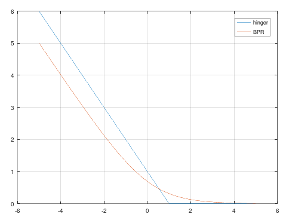

# 随想： BPR Loss 与 Hinger Loss

在之前的文章里，我们在[加速Ranknet](ranknet.md)的时候意外的得到了BPR Loss：

$$
L_{\omega} = - \sum_{i,j \in S}{log(sigmoid(s_i-s_j))}
$$

我们说过，Ranknet可以不定用NN，任何可微的模型都可以塞到后端去。其实我们一直没有用贝叶斯的观点来看Ranknet，只是给分数的差值加了一层 sigmoid 之后使用 二元交叉熵损失函数，四舍五入一个亿…啊不对…等于是Logistic回归了，结果就导出了BPR Loss一样的形式。


嗯？Logistic回归？也就是说只要是分类模型都可以往上咔咔猛造咯？那为啥一定得是Logistic回归呢？我们可以把身子换了，那干脆把头也换了？

其实，平时还会用到另一个Loss，合页损失，一般用在SVM上：

$$
L_{\omega} = \sum_{i,j \in S}{max(0,1-s_i+s_j)}
$$

那SVM效果会比Logistic回归好多少吗？不会的，画出来一看就知道了：

```
x = [-5:0.01:5];
plot(x,max(0,1-x),x,log(1+exp(-x)))
legend('hinger','BPR')
```



简直就是：


我在我们的系统上做了一些离线实验，结果是BPR略微胜利，我认为原因可能在BPR更加嫩滑…啊不对…光滑上。但是就计算量而言，肯定是Hinger Loss要远远小于BPR Loss。
