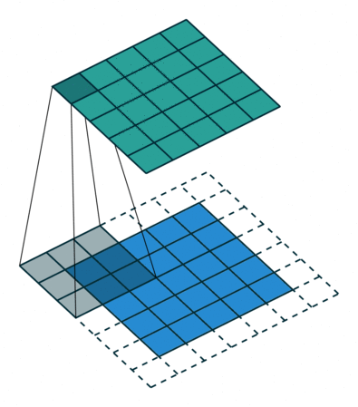

# Understanding LightGCN in a visualized way

In this article, I'm going to introduce LightGCN, a new algorithm for collaborative filtering problem.

## What's LightGCN

LightGCN is a shorten of Light Graph Convolutional Neural-network, it's a new approach for collaborative filtering which published in SIGIR 2020.

So, let's talk about what's the graph, what's the convolution and why it's called "light".

### Graph

This is the graph we have:

It can be represented as a heap of (user, item, interaction) triplets Of course, LightGCN is capable to use more than one kind of interaction (just create more LightGCN and concatenate them together).

It’s a bipartite graph of user-item interactions. The paper hasn't described but: it is capable to add user-user and item-item interactions.

### Convolution

#### How to

Let's recall about the convolution, I think convolution basically is a weighted moving average.

So, how we can extend convolutional operation to graph? The hardest problem is how to do the convolution on such a non-euclidean graph.

Non-euclidean graph means we don’t have a certain neighborhood number. But in common CNN we have a certain number of neighborhoods.

Here's the solution, we just update the current node by doing a weighted sum operation from all neighbor nodes and do it again in the next layer. Then we use multi-layers to obtain high-order connectivity.

So the "kernel" if GCN basically is $$w_{ui}$$. In my POV, it’s a low-pass filter.

Let's compare it with convolutional operation on image: it looks weird. It seems like fixing the convolutional kernel but adjusting the input signal. (Even it’s not a big deal since convolution operation is commutative.)

#### Example

So, let's take a look at this example to inspect what happened while we're doing the convolutional operator.

I made a bipartite graph manually like this:

First of all, we have to generate a symmetric adjacency matrix.

This is the structure of the adjacency matrix, we don't have user2user or item2item interaction here. O is the zero matrix, R is the **R**elationship matrix it’s a sparse matrix with user count rows and item count columns and the non-zero element is $$w_{ui}$$, the weight between node u(ser) and node i(tem).

Finally, we got the adjacency matrix like this:

But this is not enough, the signal will be amplified after several layers, so we need to normalize it, there're several ways to do the normalization, we're using the method in the paper: $$\hat{A}=D^{-\frac{1}{2}}AD^{-\frac{1}{2}}$$ The D is the degree matrix.

This is the No.1 layer.

Actually, before No.1 layer we have a No.0 layer and it is kind special, just an eye matrix, because $$\hat{A}^0=I$$

Every node doing self-connection in the graph.

Now we're going to generate No.2 layer which adjacency matrix is $$\hat{A}^2$$

Since after jump twice, the user will connect to some other users only and the item will connect to some other items only, so the graph will split into 2 parts.

It happened in every even layer, means layer No. 2 4 6 ...

Here's the 3rd-order of the graph, we can see most of the nodes connected.

The rest layers can be done in the same manner.

## Aggregation

Now we have every layer's output of the signal, let's sum it up and this is the output of the GCN: Node's embedding.

$$E_{out}=\sum_{k=0}^{N}{\alpha_k\hat{A}^{k}E}$$

There're several ways to sum it up, the paper chosen 1st one, means just let the weight as 1.

1. $$\alpha_k=1$$
2. $$\alpha_k=C^{k}_{N}$$
3. $$\alpha_k=\beta(1-\beta)^k$$

In deep learning, it's powerful because it's deep, so is this also doable in GCN?

The answer is NO!

Because in high-order layers we'll have the over-smoothing problem.

Like what I wrote previously, this is a kind of low-pass filter, so finally we will have a very stable result, almost every node has the same embedding.

This is No. 20 layer:

No. 21 layer:

And No. 22 layer:

.png>)

See? This is over-smoothing.

## Light

Since we explained what is GCN, now let's take a look at why we called it LightGCN, what is the "Light". Because this model is transformed from another model: NGCF.

It simplified the message construction and aggregation, make it linear and direct:

But why we remove them?

The author did some ablation experiments on NGCF. And we found:

* the model perform better after removed feature transformation only
* the model perform worse after removed the non-linear activation function only
* The model performs much better after removing them all!

So let's remove them all! And this is the LightGCN.

## Compare With MF

For now, I already introduced all about LightGCN, but if you're careful enough, you may already found, the LightGCN finally output a node embedding and using the dot product of embeddings as the score, so basically, we can just extract the embedding result and save it as a matrix factorization model.

Not only we can use MF to inference it directly, EVEN the parameter space, and the regularization items are also totally the same. So: Why LightGCN works? What made it different?

Here's some of my personal POV, while we're doing the message bypass and aggregation, it equals to multiply a (sparse) matrix in a left-hand side part.

$$E_{out}=\sum_{k=0}^{N}{\alpha_k\hat{A}^{k}E}=(\sum_{k=0}^{N}{\alpha_k\hat{A}^{k}})E$$

I think this matrix is kind of a constraint or said it's a special kind of regularization item, constrained the gradient bypassed to the embedding.

### More About Special Regularization

Not only in LightGCN, this technique is already applied widely.

For example, in this paper, he's trying to contribute a CTR predict model, but they add some other subtasks in training and jointed the loss.

Since they never used the model, why they have to train it?

In my POV, it's a special kind of regularization, which means the embedding is not free, it should complete some other tasks at the same time to avoid overfitting.

## Experiment

This is the result the author tested on some public dataset, it improved a lot.

## Future Work

Maybe the next step we should care about:

* De-bias & fairness
* Robustness
* Exploitation & exploration trade-off

## References

* [LightGCN: Simplifying and Powering Graph ConvolutionNetwork for Recommendation](https://arxiv.org/pdf/2002.02126.pdf)
* [Neural Graph Collaborative Filtering](https://arxiv.org/pdf/1905.08108.pdf)
* [Representation Learning-Assisted Click-Through Rate Prediction](https://arxiv.org/pdf/1906.04365.pdf)
