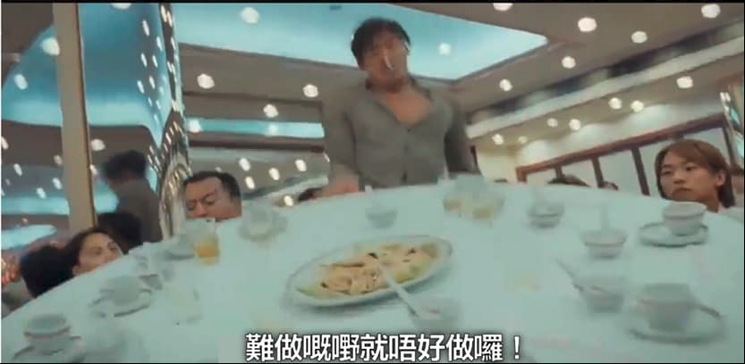

# 无采样的矩阵分解

## 前言

很久以前，有个大佬说过，集体负责制就是不负责制，真正的负责是要落实到人的。 那么反过来企业级理解，无采样其实就是全采样的意思。


这里的采样，指的是负采样，所谓负，指的就是负样本，负样本是相对正样本而言的。

比如在一个购物网站，你购入了某个sku，或者在读书网站，你如痴如醉的读了某本书，那这就是平台期待你做的行为（购买、阅读、打赏、转发等），就是正。反之，点踩，拉黑，静音，视而不见等等这些就是负。

当然，用户行为有显式隐式之分，这里不作讨论。就正负样本中，正样本比较好收集，负样本（尤其是显式的）比较难收集。

难收集？难收集就不要收集咯！



所有用户没发生过行为的，全都是负样本。然后从里面随机采样，为每个正样本拉郎配一些负样本，就可以得到训练数据集。

在这个数据集上应用Ranknet（参见这一篇：[Learning To Rank 之 RankNet](bpr\_and\_hinger.md)），就可以训练出一个像模像样的推荐系统。

可是采样也是个技术活，用户明显表示不喜欢的，采样权重是不是得高点？具体参看这一篇文章： [负样本为王：评Facebook的向量化召回算法](https://zhuanlan.zhihu.com/p/165064102)，这篇文章很好玩，我在实践中发现了和Facebook一样的结论，就是不能只用曝光未点击作为负样本，同时对负样本进行赋权也很重要。

采样这么难采，怎么办？

难采？难采就不要采咯！（梅开二度）


不采，就是全采，色即是空，这就是这篇文章的重点。我最早读到这个思路是在 _Efficient Non-Sampling Factorization Machines for OptimalContext-Aware Recommendation_ 里面，后来顺藤摸瓜找到了 _Efficient Neural Matrix Factorization without Sampling for Recommendation_ 。但是我意识到，这个Loss其实不止针对FM，任何可以把用户和物品变成向量，最后用内积评分的模型都可以采用这个Loss。

## 非采样Loss

进入正题，我们考虑用户对于系统有一些正样本 $$<u, v, c>$$ ，三元组里分别是用户，物品和正样本的权重。其实这可以表达为一个稀疏矩阵，不放记作 $$R_{uv}$$ ，横坐标为用户，纵坐标为物品，格子中就是权重，我们以往的思路就是分解这个矩阵，在分解为用户向量组和物品向量组的过程中，找到高维稀疏矩阵的低维稠密表达。

这个“找”的过程，其实就是（有损）压缩。而压缩的本质，就是找共同点，找重复处。 比如，我把`abcabcabcabc`压缩成{abc}4，就是找到了共同之处。那么用户行为矩阵 $$R_{uv}$$ 的压缩，就是找到了用户和物品的“群组”，物以类聚，人以群分。

但是压缩，意味着新的矩阵要像老的矩阵，怎么评价像不像呢？我们用L2 Loss：

$$L= \sum_{u \in U}{\sum_{v \in V}{c_{uv}(R_{uv}-{\hat{R}}_{uv})^2}}$$

这个 $${\hat{R}}_{uv}$$，就是我们压缩以后的结果，但是我们先不急着展开这个表达式，我们先展开原本的式子：

$$L= \sum_{u \in U}{\sum_{v \in V}{c_{uv}(R_{uv}^2 -2{\hat{R}}_{uv}R_{uv} + {\hat{R}}_{uv}^2)}}$$

这一步上过初中应该都能做出来，然后我们一个一个拆： ，第一项的$$R_{uv}^2$$是常数，常数求导是0，所以直接扔掉（P.S. 如果对Loss的真实数值有执念的，这个是可以算出来的，正样本权值平方求和嘛）。 第二项 $${\hat{R}}_{uv}R_{uv}$$ 是两个矩阵Element-wise相乘，$$R_{uv}$$只针对正样本是1，负样本都是0，所以可以简化为： $$\sum_{u \in U}{\sum_{v \in V^+}{c_{uv}(-2{\hat{R}}_{uv})}}$$ 最后一项是个硬骨头，且拆分以后会利用第二项与之合并，下面细说。

看到 $${\hat{R}}_{uv}^2$$ 会想起什么？考虑到 $${\hat{R}}_{uv}=P^TQ$$ (P,Q分别是训练中的User和Item的Embedding)，我们肯定是展开来，利用矩阵乘法的结合律求 $$\sum{P^TP * Q^TQ}$$，但是不行，因为 $$c_uv$$ 不是常数。

不过有困难要上，没有困难制造困难也要上，我们就干脆制造一个可以展开求和的条件。

我们首先把想办法$$\sum_{u \in U}{\sum_{v \in V}{c_{uv}}}$$拆成正样本负样本两块，$$\sum_{u \in U}\sum_{v \in V^+}{c_{uv}}$$简写为$$\sum_{pos}$$， $$\sum_{u \in U}\sum_{v \in V^-}{c_{-}}$$简写为$$\sum_{neg}$$，其中，$$c_{-}$$是给所有负样本赋的统一的值。

我们可以看到，正样本部分 $$\sum_{pos}{c_{uv}\hat{R}_{uv}^2}$$ 我们就可以和第二项合并到一起了，但是剩下的部分仍然不能方便的求和，因为只有负样本的$$\sum_{neg}{c_{-}\hat{R}_{uv}^2}$$，这里，我们凭空再变一对$$\sum_{pos}{c_{-}\hat{R}_{uv}^2} - \sum_{pos}{c_{-}\hat{R}_{uv}^2}$$出来，其中，前面的部分用于和剩余的负样本部分结合，第二部分加入到第二项中去。

我们梳理一下，第一项被我们轻松干掉了，第三项最后变成了$$c_{-}\sum{\hat{R}_{uv}^2}$$，我们用矩阵乘法运算的结合律轻松求出，第二项变成了：

$$\sum_{pos}{2c_{uv}\hat{R}_{uv} + (c_{uv}-c_{-})\hat{R}_{uv}^2}$$

看上去好复杂，其实计算复杂度一点都不高，只是正样本而已啦！

这里我给出我的Pytorch的实现，需要说明的是，这个代码我没有验证过，因为这是我从完整版简化而来，完整版里带了真负样本的计算，还有一些业务逻辑，我都给去掉了。

最后，作者的模型里是有h（最后的一层线性层）的，但是从模型看这个h完全就是冗余的，实测效果也是又没有h都没差咯。

```python
"""
unknown_negative_weight: c_{-}
positive_weight:  c_{uv}
user_embedding: P
item_embedding: Q
core_model.h: h
positive_samples: List of [user_id, item_id]
l2_regular_factor: l2 regular factor
R_pos: \hat{R}_{uv} 正样本部分
"""

R_pos = (
        user_embedding[positive_samples[:, 0], :] *
        item_embedding[positive_samples[:, 1], :] *
        core_model.h
).sum(dim=1)

classify_loss = unknown_negative_weight * torch.sum(
    (user_embedding.t() @ user_embedding) * \
    (item_embedding.t() @ item_embedding) * \
    (core_model.h.view(1, -1) * core_model.h.view(-1, 1))
)
classify_loss += torch.sum(
    (positive_weight - unknown_negative_weight) * R_pos * R_pos - 2 * positive_weight * R_pos
)

# 总体的RMSE Loss，有物理意义的那种哦
rmse_loss_value = (classify_loss + positive_weight_sum) / weight_sum
# 正样本的RMSE Loss
positive_rmse_loss_value = torch.sqrt(((1 - R_pos).pow(2) * positive_weight).sum() / positive_weight_sum)
# 当然也可以求负样本的RMSE，这里略

regular_loss = sum(
    param.pow(2).sum()
    for _, param in core_model.named_parameters()
    if param.requires_grad
) * l2_regular_factor

loss = classify_loss + regular_loss
```

## 后记+实战结果

这个Loss很有禅意，形式很简洁，论文中实验结果表示很有效。如果抛开严谨的数学推导和一些数学技巧，我们可以粗略的看到：其实整个公式相当于先把正样本也当成负样本求和，然后再给圆回来的操作，这么理解就可以直观解释 $$(c_{uv}-c_{-})\hat{R}_{uv}^2$$的意义。

但是在我实战的时候，结果显示这个Loss没有优于使用Ranknet Loss的LightGCN，我认为原因在于：我根据曝光强度，对负样本进行了分级，这个Loss做不到。

这里还需要再展开一点，我其实尝试魔改了原文的公式，把负样本加入到正样本中去，只是权重为负数，但是负样本太多了（几乎是正样本的100倍！），加上这个Loss不能分Batch训练，考虑负样本的情况下计算效率非常堪忧，丢掉部分负样本效果又下去了。 相比之下，Ranknet可以分Batch，可以在训练的时候实时采样生成样本对，计算效率和最后结果都要略微优于非采样Loss。

另外，这里不像Ranknet，正负样本是自动均衡的，怎么配平正负样本是个玄学问题，并不是正负样本权重和是1:1就好的，这个建议交给超参数调整去做（我的实验结果似乎是1：10比较好，实验做的太早了，忘了……）。

还有一点最重要的，这个Loss不支持引入Context Feature，你只能干巴巴的使用User Embedding和Item Embedding。

以上问题，我想也是实战中使用人数不多的原因。

不论如何，虽然形式简单，但是这个Loss数学上的优美仍然吸引到了我，类似的思路，今天用不到，以后遇到分解矩阵的问题或者只有正样本+无其它特征的推荐系统（比如召回模型，我这次不需要做召回所以没用上）的时候可以试一下。
