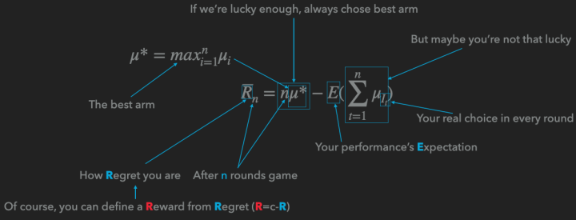

# Re：从零开始的Multi-armed Bandit

## 前言

这是一篇旨在从零开始介绍多臂老虎机（Multi-armed Bandit）算法，有点综述性质的文章。为的是在本人死前说清楚其中的Stochastic Bandit问题和几乎所有的流行的解决方案。

而写这篇文章的原因是，疫情期间猫在家里实在是太无聊了，更重要的是最近尼玛在咳嗽，一周了没见好，也不发烧，也不知道是不是新冠，只能在惶恐的情绪下写完这个文章，心里想着搞不好这就是最后一篇文章了，再不写就写不动了。作为一个鸽产作者，这是一个让人心碎的事情。

如标题所见，这是一篇有点新人向的文章，但是即使你已经烂熟Stochastic Bandit系列算法，也不妨过来扫读一下，这里一些算法我会给出自己的理解。

虽然是新人向，但是最好还是有点概率论和线性回归（尤其是岭回归）的预备知识，否则看起来会有点痛苦。

## 啥是Multi-armed Bandit

想要知道啥是Multi-armed Bandit，首先要解释Single-armed Bandit，这里的Bandit，并不是传统意义上的强盗，而是指吃角子老虎机（Slot Machine）。按照英文直接翻译，这玩意儿叫“槽机”（这个翻译也是槽点满满），但是英语中称之为单臂强盗（Single-armed Bandit）是因为即使只有一个手臂（摇把），它也可以抢走你所有的钱。中文“老虎机”的老虎，也是这个意思。

尽管号称强盗，但是这个机器还是会给你一些收益，而不同的老虎机，特性也不同，如何快速找到吐钱最多的老虎机——或者说，如何在玩多个老虎机的时候取得最大的收益，这个问题，就是Multi-armed Bandit的原型。

## Stochastic与Non-stochastic

这一下就可以把Bandit问题分成两大类。

Stochastic是随机的意思，但是这个随机和Random又稍微有些不同，是有章法的随机。换言之，收益服从某一个确定的分布。例如抛硬币的游戏里，收益服从伯努利分布，或者我们可以设计一个收益服从高斯分布或者指数分布的游戏。。。。

而Stochastic Multi-armed Bandit 还有一个假设就是没有外部信息，一旦引入外部信息，我们就称之为Contextual Bandit了，就是有上下文的Bandit。

我们今天主要介绍的就是Stochastic Bandit，同时作为UCB算法的延伸，我们会介绍一下Contextual Bandit里面的LinUCB算法。

## Stochastic Bandit

Stochastic Bandit的核心就是这个公式：

$$
{\overline{R}}_n=n\mu^* - E(\sum^{n}_{t=1}{\mu_{I_t}})
$$

关于这个公式，我可以给出一张图来说明：

这里使用的是Regret，也就是你距离理想状态的差距来定义。也可以用Reward，也就是你玩了多轮游戏以后的收益。

解决这一类问题，我们有很多种办法。

### 嘛也不干

对，躺着也是一种解决方法，所谓躺着，就是每次随便选中一个ARM，这种方法看上去一点效果也没有，作用会在与其它算法结合之后体现。 朴素

前K_m轮我们嘛也不干，即平等的选择每一个臂，在K轮之后，我们永远选择平均收益最大的那个臂。你可以把前面的K_m轮视作一个AB测试。

这种方法的问题在于，如果m选的太大影响收益，如果m太小了会导致严重的过拟合。

我在实验的时候就多次发现过拟合的存在（实际上根据实验的配置我可以准确的计算出过拟合的概率，哈哈哈）

### $$\epsilon-greedy$$

每次生成一个0～1之间均匀分布的随机数x，如果x小于 $$\epsilon$$ ，那就选择“嘛也不干”算法（探索），如果x大于 $$\epsilon$$，那就算则“朴素”算法的后半截——选目前最优的那个臂（利用）。

需要说明的是，这个算法看上去简单，实际非常有效，可以有效的避免过拟合的问题。

更重要的是，这个算法是我们人类大脑可以模拟的极限了，接下来的几种算法，如果不用计算机的话，执行起来会很困难。

所以如果有朝一日去赌场，请务必——别赌了，回来吧，赌场里都是骗人的（你以为我会劝你用算法？别天真了。。。）。

### Boltzmann Exploration

如果我们在每一步给每一个ARM赋予一个概率，这个概率由如下公式定义：

$$
p_{i}^{t+1}=\frac {e^{\mu_i^t/\tau}} {\sum_{j=1}^{K}e^{\mu_j^t/\tau}}
$$

那我们就得到了玻尔兹曼探索算法。这个算法有着比较厚重的物理背景，其中的 $$\tau$$ 表示的是温度常数，而 $$\mu$$ 表示的是这个摇臂的均值。

需要说明的是，这个算法我很喜欢，但是实际效果并不好，喜欢是因为他有物理背景，而讨厌是因为 $$\tau$$ 特别不好调整，经常容易不收敛或者过拟合。

一个解决方法是把 $$\tau$$ 定义成随时间变化的量。定义成一个单调递减的函数，这样就有退火算法内味儿了，但是烦恼的事情随之而来，之前我参数只要定义一个或者几个实数，现在倒好，要我直接给出一个函数。

当然我们可以继续照抄物理学里的温度变化的公式形式（指数下降），但是如果你看过铁碳合金相图就知道，温度下降的速度也会影响最后的材料品质，同理，温度下降的参数也会影响算法的效果，实在过于复杂，这里就放弃了。

### Thompson sampling

#### Beta分布

在介绍汤普森采样之前，我们首先要介绍Beta分布。记得第一次接触Beta分布的时候，直接给我搞懵逼了，他会和你说Beta分布是吉布斯（Gibbs）分布的一个特例，然后就会陷入吉布斯分布和采样的大坑。

其实Beta分布没有这么复杂，Beta分布最初用来描述抛硬币游戏里，正面出现概率的分布。

举个例子，我抛了2次硬币，都是正面，然后我就说，这个硬币正面的概率是100%——这显然不合适。所以，这个时候我们需要一个分布来描述这个概率。同时，这里还有一个挑战，叫Conjugate Prior，共轭先验，换句话说，我们要求先验分布和后验分布有同样的形式。

我们就想到了，既然硬币的分布是服从伯努利分布： $$p(x)=p^x(1-p)^{1-x}$$ ，那么我们直接把它“堆起来”就能得到Beta分布的形式：

$$
Beta(\mu|P,N)=\frac{\mu^{P-1}(1-\mu)^{N-1}}{\int^1_0{\mu^{P-1}(1-\mu)^{N-1}}d\mu}  =\frac{\Gamma(a+b)}{\Gamma(a)\Gamma(b)}\mu^{P-1}(1-\mu)^{N-1}
$$

说实话，我喜欢前面一种描述，因为下面那一坨或者Gamma函数那一坨，只是为了让函数的积分为1。

这里的P，N分别是正面和反面的次数。

#### 正式进入汤普森采样

我们现在给每个ARM都有了一个Beta分布，那么我们针对每个ARM进行一次采样，就是依据这个ARM的Beta分布生成一个随机数，随后挑选数字最大的ARM。

对比上面的Epsilon Greedy，我们可以看到，这样的定义更加自然一点，从问题的分布定义直接一路推到如何采样，在数据累计的过程中，我们对均值估计的置信度也在变化，而汤普森采样很好的抓住了这种置信度的变化。整个公式没有一个自由参数，这是我最喜欢的地方。

不过缺点就是：只能够用于硬币问题，也就是Reward必须是0或者1。

说到抓住均值的置信度的变化，我们必须要介绍UCB算法了。 Upper Confidence Bound

这里的UCB是置信度上确界的意思，之所以是Upper是因为我们在针对Reward进行分析，如果你的问题用的是Regret的话那就是Lower Confidence Bound，采用的是下却界。

UCB算法讲究的就是一个乐观，也就是我尽可能的相信这个ARM能做到它的上确界，举个不恰当的例子，同样一个青年和一个中年人，他们的智商是一样的（均值一样），这个时候我倾向于选择青年，因为青年的不确定性更大。

这里要说，青年的不确定性，既有向上的部分，也有向下堕落的部分。这个青年可能成为一个人才，也可能成为一个赌棍流氓。那么我们为什么选择青年呢？这就是UCB算法的乐观所在，它乐观的相信每一个不确定性高的ARM一定能达到该不确定范围内的最大值。正是这种乐观，所以UCB最后基本都能收敛到最优。

那么我们怎么评估这个上确界呢？

这里要用到一个叫hoeffding inequality的东西：

$$
P\{|\overline{x}-E(\overline{x})|\le\delta\} \ge 1-2e^{-2n\delta^2}
$$

我们可以定一个p，这个 $$p=1-2e^{-2n\delta^2}$$ ，例如0.95或者0.99吧，随后我们可以计算出这个 $$\delta$$ ，这个就是上确界到均值的距离。

那为什么这个 $$\delta$$ 和p有这样的函数关系呢？本质上还是大数定律惹的祸，仔细看看，是不是发现这个函数形式是Gaussian分布的形式？

而随着样本的累积，n不断增大，这个确界就会慢慢的收紧，就好像随着我们个人的发展，我们的人生的可能性也在不断减小（当然很多时候减少的只是上确界，堕落还是没有底线的，这真尼玛是个让人悲伤的故事）。

好了，我们现在可以推出上确界的公式了：

$$
U_{i} = \mu_i + \sqrt{\frac{2lnT}{n}}
$$

本质上，后面那一坨就是p的逆函数，这样就不难理解为什么UCB公式是这个亚子了。

### LinUCB——Make UCB Great Again

如果硬要说这么完美的UCB算法有什么缺陷的话，那就是不能利用外部信息，而推荐系统里面是有外部信息的——用户的ID，Embedding，Item的关键词，Embedding之类的。。。

就算是吃角子老虎机也有型号啊，大小啊之类的是不是？

那如何利用这些信息呢？

我们可以考虑用线性回归来学习这些内容，同时我们得想个办法干他一炮——不是，得想个办法估计一下上确界。

首先我们可以得到UCB里的均值的公式：

$$
E(r_{t,a}|x_{t,a}) = {x_{t,a}}^T\theta_a^*
$$

其中 $$x_{t,a}$$ 就是我们拿到的上下文，这个上下文一般是User和Item的组合特征，而 $$\theta_a^*$$ 是我们要学习的参数。

很明显的线性公式，那么参数估计就可以用这个岭回归：

$$
\theta_a^*=({D_a}^TD_a + I_d)^{-1}{D_a}^Tc_a
$$

如果你没印象了，可以去翻翻PRML第三章。

重点来了，文中给出估计上确界的方式是：

$$
b_{t,a} = (1+\sqrt{\frac{ln(2/\delta)}{2}})\sqrt{   {x_{t,a}}^T({D_a}^TD_a + I_d)^{-1}{x_{t,a}} }
$$

其中概率 $$p=1-\delta$$

我们怎么理解这个公式呢？按照我在后面给出的参考文件里面的方法去推也可以，或者听一下我的这个理解：

我们知道，线性回归除了可以从最小均方根误差求偏导为0导出，还可以由残差服从正态分布，然后做极大似然估计导出。

知道了这些，你再看看 $$\sqrt{\frac{ln(2/\delta)}{2}}$$ 长得像不像正态分布的逆函数形式？而 $${x_{t,a}}^T({D_a}^TD_a + I_d)^{-1}{x_{t,a}}$$ 中间难道不是协方差矩阵吗？

当然我这么理解不严谨，如果你追求严谨的理解，请去看下面列出的论文。

## 杂谈

一口气介绍了这么多算法，下面说一下一些闲言碎语。

我喜欢没有参数，或者参数有具体的物理意义，数学意义的算法，比如Boltzmann Exploration，UCB和汤普森采样都是我心目中理想的算法的样子。理论看上去很完美，但是在生产中还有更多的问题，比如如何把商业指标和你的Reward联系在一起？在实验中你可以立刻得到反馈的Reward，如何处理无法立刻得到Regret或者Reward的情况？UCB固然很美好，但是所有的拓展都要求计算上确界，理论分析是个很麻烦的事情，有没有什么方法可以模拟出一个哪怕不是很精确的上确界？

## 参考文献

首先推荐这两篇论文：

1. [Regret Analysis of Stochastic and Nonstochastic Multi-armed Bandit Problems](https://arxiv.org/abs/1204.5721)
2. [Introduction to Multi-Armed Bandits](https://arxiv.org/abs/1904.07272)

与其叫论文，不如叫教科书，你看过哪篇论文里他娘的有课后习题的。

这两篇书的叙述结构稍微有点不同，但是理论都是一样的严谨，换句话说，不是很好理解，我也没有全部读完，但是，读blog这种非正式读物（比如我这篇文章）的时候，你会期待有一个词典一般的书供你查阅。

关于UCB里面用到的不等式，其实是大数定律的进一步扩展，这里我们可以阅读这篇老的掉牙的文献：

[Probability Inequalities for sums of Bounded Random Variables](https://link.springer.com/chapter/10.1007/978-1-4612-0865-5\_26)

虽然老的掉牙，这篇文章不可谓不硬核，希望各位谨慎入内，到时候不要哭着关闭浏览器。

[A Contextual-Bandit Approach to Personalized News Article Recommendation](https://arxiv.org/abs/1003.0146)

上面这篇就是LinUCB的原文了，但是这里面主要介绍了怎么应用，没有介绍怎么能推导出LinUCB的公式内容，这里有篇硬骨头告诉你公式是怎么来的，我已经有点知难而退了。希望各位迎男而上：

[Exploring compact reinforcement-learning representations with linear regression](https://arxiv.org/abs/1205.2606)

如果你不满足于线性模型带给你的快感可以尝试一下非线性模型：

[Finite-Time Analysis of Kernelised Contextual Bandits](https://arxiv.org/abs/1309.6869)

这篇文章就在LinUCB的基础上引入了核方法，换句话说，用SVR（支持向量回归）的哪一套理论替代了岭回归。

先写这么多，祝各位身体健康。
