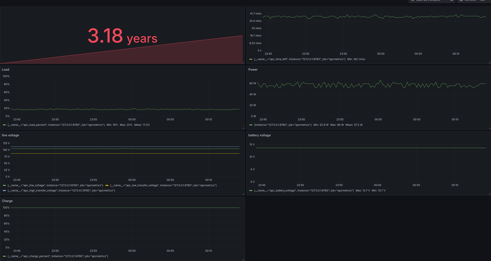

# 在Linux读取并且监控APC UPS的状态

我买了一台[APC 無停電電源装置 UPS 常時商用給電 550VA/330W BE550M1-JP 矩形波 家庭用](https://www.se.com/jp/ja/product/BE550M1-JP/apc-ups-es%E3%82%B7%E3%83%AA%E3%83%BC%E3%82%BA-%E5%8D%98%E7%9B%B8100v-550va-330w-%E5%B8%B8%E6%99%82%E5%95%86%E7%94%A8%E7%B5%A6%E9%9B%BB%E6%96%B9%E5%BC%8F-%E7%96%91%E4%BC%BC%E6%AD%A3%E5%BC%A6%E6%B3%A2-%E3%82%B5%E3%83%BC%E3%82%B8%E4%BF%9D%E8%AD%B7%E4%BB%98%E3%81%8D-3%E5%B9%B4%E4%BF%9D%E8%A8%BC/)。


这么几年我一直都是靠一台Windows上的软件监控的，但是这种每次都要通过眼睛去看的方案并不是特别方便。而且也没有办法查看历史数据。 
今天搜索了一下，其实是有linux的方案的。特别在此记录一下 。

## APC UPS 连接

我的UPS是通过USB和电脑进行连接的，接好线缆以后执行下面的指令可以看到设备：

```
$lsusb | grep "American Power"
Bus 002 Device 009: ID 051d:0002 American Power Conversion Uninterruptible Power Supply
```

就说明有希望。

安装相应的软件：

```shell
sudo apt update
sudo apt install apcupsd
```

修改配置文件 `/etc/apcupsd/apcupsd.conf`

确保UPSCABLE是usb，UPSTYPE是usb，DEVICE留空（但是不要注释），类似这种感觉：

```
UPSCABLE usb
UPSTYPE usb
DEVICE
```

修改配置文件：`/etc/default/apcupsd` 为

```
ISCONFIGURED=yes
```

启动服务，设置自启动：

```
sudo systemctl start apcupsd
sudo systemctl enable apcupsd
```

这个时候执行 `apcaccess status` 就可以看到UPS的状态了。 

类似下面这样：

```
APC      : 001,036,0861
DATE     : 2026-05-02 00:05:36 +0900  
HOSTNAME : g470
VERSION  : 3.14.14 (31 May 2016) debian
UPSNAME  : g470
CABLE    : USB Cable
DRIVER   : USB UPS Driver
UPSMODE  : Stand Alone
STARTTIME: 2026-05-01 23:00:20 +0900  
MODEL    : APC ES 550M1 
STATUS   : ONLINE 
LINEV    : 105.0 Volts
LOADPCT  : 18.0 Percent
BCHARGE  : 100.0 Percent
TIMELEFT : 37.5 Minutes
MBATTCHG : 5 Percent
MINTIMEL : 3 Minutes
MAXTIME  : 0 Seconds
SENSE    : Medium
LOTRANS  : 87.0 Volts
HITRANS  : 113.0 Volts
ALARMDEL : 30 Seconds
BATTV    : 13.7 Volts
LASTXFER : Automatic or explicit self test
NUMXFERS : 0
TONBATT  : 0 Seconds
CUMONBATT: 0 Seconds
XOFFBATT : N/A
SELFTEST : NO
STATFLAG : 0x05000008
SERIALNO : 4B2232P06646  
BATTDATE : 2023-02-26
NOMINV   : 100 Volts
NOMBATTV : 12.0 Volts
NOMPOWER : 330 Watts
FIRMWARE : 933.a7 .A USB FW:a7
END APC  : 2026-05-02 00:05:44 +0900  
```

## Prometheus监控

我让AI给我推荐了几个方案，比如 [mdlayher/apcupsd_exporter](https://github.com/mdlayher/apcupsd_exporter) ，不过我最后选择了 [56quarters/apcmetrics ](https://github.com/56quarters/apcmetrics)。

Clone到本地，进入项目文件夹，然后直接 `make build`，注意，你得先把make和[go](https://go.dev/doc/install)装上，我很少在服务器上Build软件所以居然都没有装。

然后把Build出来的产物送到bin目录下：`sudo mv apcmetrics /usr/local/bin/`

按照教程复制Service并且启动就好了。

```
sudo cp ext/apcmetrics.service /etc/systemd/system/
sudo systemctl daemon-reload
sudo systemctl enable apcmetrics.service
```

完后可以用curl确认一下是不是已经启动了：`curl http://127.0.0.1:9780/metrics`

在Prometheus里面增加监控项：

```yaml
scrape_configs:
  - job_name: apcmetrics
    static_configs:
      - targets: [ 'you-ip:9780' ]
```

重启或者Reload即可。

## Grafana Dashboard

没找到Dashboard，自己动手撸了一个 很粗糙的版本，以后慢慢优化了。



[json配置文件放在这里了](https://gist.github.com/TsingJyujing/d2830a556820a5c02494bf104a2ddbeb)，需要的自取。


## 有些麻烦但是想做的事情

- NAS断电的重启恢复会有些困难，如果能够时刻监控剩余使用时长，在断电前执行关机操作会非常好。
- 重新来电以后树莓派会自动启动 ，这个时候如果能够通过网络自动启动服务器那就更好了。

## 吐槽

我买UPS才花18000日元，[换电池](https://www.se.com/jp/ja/product/APCRBC122J/%E4%BA%A4%E6%8F%9B%E7%94%A8%E3%83%90%E3%83%83%E3%83%86%E3%83%AA%E3%83%BC%E3%82%AD%E3%83%83%E3%83%88-br400sjp-br550sjp-be550m1jp%E7%94%A8/)居然也要15000日元，这何尝不是一种计划报废呢？