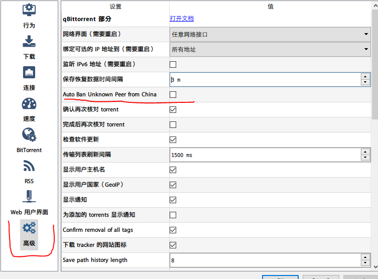

# 干掉吸血雷，重塑和谐P2P环境

在我不懂技术的时候，经常使用迅雷下载各种电影，软件，迅雷很好的解决了死链之类的问题，现在来看，在那个带宽不充足的年代，缓解了一部分服务器的下载压力。 但是迅雷对于整个P2P环境的破坏是极大的，你经常可以在peer里面看到很多客户端名字为XL00+一堆乱码，或者Xunlei，7.x.xx之类的，永远只从你这里下载，而不给你上传。

说实话，我不是个吝啬带宽的人，我自己用的是光纤，而下载速度上传最快都是可以突破百兆的，我还有公网IP。所有的下载资源，我都会等待分享比率为2.0或者等了很久没人来下载我才会撤。 P2P要能玩下去，平均每个人的分享比率需要大于1.0才可以。

而迅雷，则是这样做的：

1. 如果对方不是迅雷的客户端，那我就只下载，而不给他上传数据。
2. 如果对方是迅雷的客户端，则优先给会员数据。

除此之外还有百度的离线下载，Xfplayer等等等等。

最后导致大家开发了反吸血的qBittorrent。



## qBittorrent 反吸血增强版

如果你是Win或者Mac的客户端，可以尝试下载这位大神Fork的反吸血增强版：

[https://github.com/c0re100/qBittorrent-Enhanced-Edition](https://github.com/c0re100/qBittorrent-Enhanced-Edition)

Mac用户可以直接用Brew安装：

```bash
brew cask install c0re100-qbittorrent
```

Linux的用户可以自己编译，下载软件源的编译好的结果，或者使用Docker版：

[https://hub.docker.com/r/superng6/qbittorrentee](https://hub.docker.com/r/superng6/qbittorrentee)

## 关于反吸血的一点畅想

P2P的协议的缺陷在于，假定每个人，尤其是软件制作者都是善良的，这个假设非常脆弱。

我猜想以后迅雷这样的软件可能会冒充其它软件来获取数据，对于这种方式，我们需要其它的屏蔽手段：

比如，我们可以每个人在下载的时候尝试探测对方。

1. 你还没数据，对方已经下载了85%，但是拒绝给你提供任何数据。
2. 或者你已经给对方提供了某个block的数据，但是和对方请求这个block的数据的时候却无法下载

这样的例子多次出现，可以BAN了对方。

对方有可能在给别人上传而顾不到你，这个时候，不能运用这些准则百分百判断对方就一定是吸血，但是我们可以设定行为权重，如果出现次数较多，那我建议自动BAN掉这个IP一周再释放。 而P2P协议应该也允许你获取其他人的黑名单，而你可以设置参考权重，选择参考或者不参考。

甚至可以用最优化的理论来调节这些权重，在不影响下载和分享的前提下，尽可能屏蔽掉多的IP，这样不好好分享的人就很难捞到好处，而又不至于对P2P生态破坏太大。

有些人可能说，我上行带宽吃紧（比如电信，下行和上行差距就非常大），那照我说，上行带宽吃紧就不要参与这个P2P了，连100k都贡献不出来就算了。
