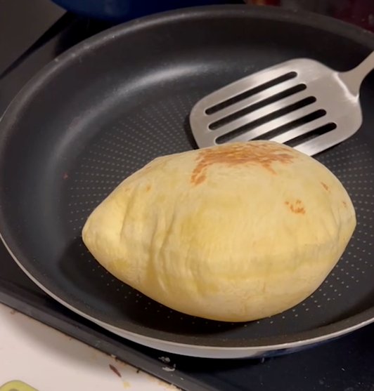

# 皮塔饼

皮塔饼（英语：Pita），又称阿拉伯薄面包或口袋饼，是一种圆形口袋状面食，广泛流行于希腊、土耳其、巴尔干半岛、地中海东部地区和阿拉伯半岛。皮塔饼中的“口袋”是由蒸汽膨胀形成，面饼冷却后变得平坦，中间留下一个口袋。——Wiki

## 配方

| 配料         | 剂量       | 备注                                               |
| ------------ | ---------- | -------------------------------------------------- |
| 面粉         | 250g       | 中筋面粉或者高筋面粉均可，推荐高筋面粉             |
| 油           | 20g        | 有教程推荐使用橄榄油，实际过程中任何喜欢的油都可以 |
| 盐           | 5g         | （经测试，实际操作中略少一些也可以）               |
| 糖           | 5g         | -                                                  |
| 泡打粉       | 1g         | -                                                  |
| 酵母粉       | 2g         | -                                                  |
| 水           | 115g～125g | -                                                  |
| （可选）鸡蛋 | 1个        | 一个鸡蛋约折合50g水                                |
| （可选）奶粉 | 10g        | 这里我没有奶粉，所以将一部分水换成牛奶             |

## 面团的制作和发酵

### 大面团制作

如果有厨师机或者面包机的话，可将上述材料直接混合到一起搅拌，然后发酵就行。

如果没有，那就采取以下步骤：

1. 将酵母粉用水化开备用
2. 将面粉，盐，糖，泡打粉，奶粉（如果有的话）混合均匀，中间打入鸡蛋
3. 将鸡蛋打散，打散的时候，鸡蛋会逐渐和面粉混合到一起，再中央形成一个较稀的面团
4. 将刚才的酵母粉水慢慢加入，用筷子搅拌直到形成一个不均匀的面团
5. 手上粘上一部分的油，揉面，揉到初步均匀即可。
   * 由于这个面特别的软，如果手上不抹油的话会很难揉。
   * 实在没法揉就等几分钟（醒面），水会自然在各部分间相互渗透，届时会好揉一些，不用和面团较劲。
6. 醒面10～20分钟。
7. 手上抹油继续揉面，直到把剩下的油都揉将进去。
8. 封闭发酵到2倍大，约要45分钟～1小时。

### 揉面备注

这个面团配方的粉水比大约在1.42～1.5，要知道，比较硬的面团（如面条面），粉水比约在2.17，比较软的面团（如制作包子馒头）在1.8左右，粉水比低于这个数字就较难直接揉了。如果没有厨师机，就遇到了不得不揉这么一团湿面的惨状。湿面团极其粘手，如果没有手粉或者油脂作为辅助，是没法揉的。

揉面的手法大致有两种，揉和揣，揉是用手指将面叠起来以后用手掌压下去，而揣是用五指将边缘的面叠起来或者捏到中间以后用拳头压下去。
揣面更加不容易吸油，借此机会可以给面整形但是对混合均匀无大益。而揉面相对更多的会将外层的面压裂而吸收更多的油，一般用在想要混合均匀的时候。

第一遍揉面的时候，面是非常不均匀的结构，一般先揣几遍，然后揉到均匀即可。
第二遍揉面的时候，由于会放很多的油，所以以揉为主，发现面团均匀并开始粘手的时候，就用揣整形准备发酵。

关于油脂，再开始揉面之前，可以在手上涂一些高熔点的动物性油脂（比如猪油（但是这样阿拉伯人就没法吃了））可以极大的减少满手面糊的情况。相应的，要在面团的用油中扣去这一部分的重量。

### 小面团制作

发酵完成以后，首先排气，将面团里的大气泡全部挤出去。
这些大气泡如果保留，烙饼时鼓起来就会特别薄，成为整个面饼的阿克琉斯之踵，一旦破裂，蒸汽无法保留就再无鼓起来的可能。

将面团分割成70～80g左右的剂子，并且滚圆备用。

面团仍然是粘手的，但是组织既已稳定，这个时候一些手粉就可以解决问题。也不要破坏

1. 这个面团放在冰箱里冷藏会更好
   * （未验证）冷藏以后的饼皮会比直接使用的饼皮更软
2. 这个面团（或者之后做成的饼皮）是可以冷冻的，可以成为特别方便的早餐。
   * 冷冻的面团解冻以后再擀一下

取出一个小面团，擀开，这时候会遇到阻力，因为面团自带较大的筋性，即，面团中的蛋白质（麸质）已经在水和盐的作用下结成网状结构，倾向于保持原有的状态，突如其来的外力并不能猝然改变其形态。

所以将面饼擀开一点后就静置数分，让它适应新的形状，形成新的结构，此时再擀便又能擀开些。

一般来说两遍就足矣，当一个小面团成为一个直径二十厘米左右的圆形小饼时，就可以开始烙饼或者烤制了。如果喜欢，制作面饼的时候可以在一面上撒上炒熟的芝麻，则成塔斯汀的汉堡胚。

## 烙制

只需要一个平底锅即可制作，首先预热平底锅，然后放入面饼，一面烙制到可以滑动的时候，立刻翻面，第二面也烙制到可以滑动时即再翻面。面饼应该微微起皱，甚至又多一点淡黄色的烙印，如果没有，说明温度不足，可再如此翻面两次直至两面封闭。
也不可焦黄，焦黄说明则火太大，两面都脆了时鼓不起来的。

若两面既已封闭，此时开大火，面饼则会自然鼓起。鼓起到一半的时候翻面，用铲子或者无情铁手将为鼓起来的部分贴住锅底，不消片刻就可以鼓的像个球一样。

## 烤制（未验证）

上下250度预热完成之后推入烤箱烤制即可，烤制这个饼的温度是高一点，时间短一点比较好，鼓起来即可出炉。

## 参考资料

- [塔斯汀慌了，中式汉堡做法原来这么简单！](https://www.bilibili.com/video/BV1Jx4y1c7sm/)
- [皮塔饼 Pita Bread 饼大如球 做法有趣 进来瞧瞧吧](https://youtu.be/_zVEKAtqfvk)
- [Pita](https://en.wikipedia.org/wiki/Pita)