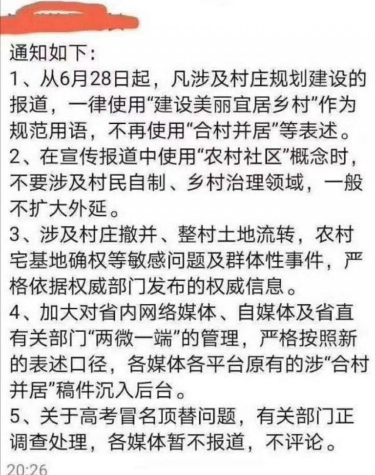

# 中国网络防火长城简史

## 简介

计算机的防火墙，和物理意义上的墙并不一样，物理上的墙建立以后，那就既进不来，也出不去了。而计算机的墙，则是可以对两个方向进行控制。

其实我们今天所说的计算机防火墙，大致有两种，一种是对内的，一种是对外的。

传统意义上的防火墙，一般是用来防止外部访问的，当然，你也可以设置禁止访问某些IP或者网站，禁止内部访问。

我们使用计算机的时候，会开放很多端口，比如22，139，3389等等，而作为非开发者的用户，往往用不到这些端口。 再考虑到使用这些端口的程序有的时候是有漏洞的，开放了容易被攻击，所以干脆打开防火墙封闭了就好。 这就好比你日常宅在家，并不需要出门，就把锁孔都堵死来保证安全一样。

而我们今天讨论的主角，主要的功能不是阻止别人进来（入侵），而是阻止你出去的。 你访问不了Google/Youtube/Facebook/LINE/Twitter/。。。的根本原因： **防火长城，GreatFireWall，简称GFW。**

每当谈起互联网的历史，都会有一种恍如隔世的感觉，当年上网大部分的网站并不需要注册，博客随便看，甚至可以匿名评论。就算要注册，有个邮箱就够了，不需要实名制（实名制在今天的体现是大部分网站注册都要手机号）。大家在网上大体友善的讨论，无私的分享，自由的交谈。几乎所有的网站不需要VPN即可访问。搜索引擎就管搜索，聊天软件也只聊天，没有那么多弹窗和流氓软件。那是互联网的田园时代。

和之前的[互不联网公司是如何强奸用户的(持续更新)](https://github.com/TsingJyujing/blogs/tree/7ddd1d57ad13443ac90c8cc90b23cf62bd14bb9c/spam/spam/rape-user.md)一样，老网虫应该都对这些事情有一些印象，而00后乃至10后可能并不知道这些黑历史。 不论是寿司之神，还是其他顶级的厨师都说过，要想成为好的厨师，首先要吃得出什么是美食。最近辗转反侧，我觉得有必要把这些内容写出来，让人看见，哪怕只是一两个人，告诉大家互联网原来应该是什么样子的，今天为什么是这个样子。

## 墙的历史

1987年，中国发出了第一封电子邮件：“Across the Great Wall, we can reach every corner in the world”（越过长城，走向世界每个角落）。从那一年开始，我们用互联网和这个世界联系在一起了，但是就在12年后，那个越不过去长城，回来了。

1998年，为了防止大家访问部分网站，针对IP和DNS的污染，开始了。伴随着污染，墙和梯的较量正式开始。 早期的GFW不能称之为墙，更像是一个补丁，只是单纯的污染DNS，那么我们修改DNS服务器就可以绕过去。 加上国内的DNS也流氓，所以大家大多会把DNS改成Google提供的 `8.8.8.8/8.8.4.4`。

这样幼稚的屏蔽方式，政府也知道是不行的，于是，真正的GFW正式登上历史舞台。

除了屏蔽特定的IP或者域名之类，GFW还会审查流量内容，因为当时大部分的网站都没有用HTTPS进行加密，所以流量是非常透明的，审查起来很容易。 当然，也会对URL进行审查，有一段时间Google无法访问，就是因为URL里面又一个叫`gs_rfai`的参数，其中“rfa”字样，与在大陆被封锁的自由亚洲电台的网址和英文缩写巧合而被GFW屏蔽。 近几年HTTPS普及了，针对内容审查手段也就慢慢失效了。

墙的其它升级就简单的多了，主要就是两个任务：

1. 针对IP、域名列表的扩充，扩大黑名单范围；
2. 对新增的翻墙工具的封堵。

这些是功能上的升级，性能上也在升级，据传说16年，GFW就拥有100多台小型机做的集群了（而且，各地的GFW似乎也没能完美的同步（也可能是故意的），大致是以省为单位，有的时候会出现某个网站只能被某些省访问的情况出现）。

举些升级的例子：

* 比如你用HTTP/SOCKS代理翻墙，那我就检测代理的流量特征（于是HTTP/SOCKS代理，卒……）。
* 你用SSH翻墙，我就检测你的流量特征，分析你到底是在执行命令，传输文件还是在打隧道翻墙
  * 但是SSH隧道目前仍然可用，技术角度说，完全区分SSH/SFTP和翻墙流量还是有难度的
* 你用GoAgent翻墙，那我就屏蔽Google的所有IP。
* 你用PPTP翻墙，那我就检测PPTP的协议，直接杀。
* OpenVPN也遭遇了PPTP同样的待遇。
* 但是AnyConnect没有，因为很多外企在使用它连接公司内网。
* Shadowsocks也差点遭受和各大VPN一样的待遇，但是因为SS的流量实在难以识别，所以当时（大约2015年）解决的方式更加粗暴：请Shadowsocks的作者喝茶。

* 后来（大约2020年前）Shadowsocks还是被识别了，参见[这个报告](https://gfw.report/blog/gfw\_shadowsocks/zh.html)。
* 目前最强大的工具应该是V2Ray，除了支持的协议多，其中的VMess协议对计算机时钟的要求让这个系统可以抵御一定的流量重放攻击。
* 最近大家开始用Vultr/Linode搭建服务器……这个的确不好管，但是重要节假日（每年0110月/0100日前后，国庆，两会）就批量屏蔽这些IP。
* GFW不仅防止国内用户访问国外主机，有的时候还会禁止一些境外IP访问国内的主机，这样可以屏蔽部分使用内网穿透技术的人。

## 今天我们怎么翻墙

1. HTTPS代理，TLS给HTTP代理穿上了铠甲，使之又能再战500年。但是考虑到GFW会主动刺探，所以最好将代理的endpoint隐藏在正常网站的某个子路径下。
2. SSH隧道，SSH采用非对称加密，再加上有广泛的正常用途（管理服务器）所以目前SSH隧道还是可用的。
3. Shadowsocks/V2Ray/GoProxy 其实可以理解为对你的代理流量进行加密和混淆的工具，但是GFW在慢慢尝试识别这些流量。
   * 需要特别说明一下的是，GoProxy比较特殊，支持内网穿透。
4. AnyConnect等商用方案。

除此之外，还有内网穿透等一系列骚操作，日后我会补充一些教程，教大家如何搭建自己的翻墙服务。 当然，这一系列教程不能说翻墙，也不能说科学上网，要说连接公司内网，本质上，在公司外部管理公司内网和翻墙的技术基本一致，但是会多一些诸如混淆之类的不必要操作。

## 我对墙的记忆

事实上，我个人没有经历过只有DNS污染这个阶段，我第一次感受到墙的威力，是谷歌退出中国。

山雨欲来风满楼，事实上，早在2007～2009年，就开始出现一些Google搜索的负面新闻：

> 据了解，今年１月和４月，“谷歌中国”网站因存在大量淫秽色情和低俗链接，曾两次被互联网违法和不良信息举报中心公开曝光。近期，举报中心又接到公众举报，经核查发现，“谷歌中国”网站仍然存在大量淫秽色情和低俗信息，包括大量极其低级、丑陋的色情图片、视频和文字。 举报中心有关负责人表示，“谷歌中国”网站未按照我国法律法规的要求做好淫秽色情内容的过滤工作，大量境外互联网上的淫秽色情信息通过该网站传播到我境内，严重违反了《全国人大常委会关于维护互联网安全的决定》和国务院《互联网信息服务管理办法》等法律法规，以及有关行业自律规范，严重侵害青少年身心健康，损害公众利益。 举报中心在强烈谴责“谷歌中国”网站的同时，还建议相关执法部门依法处罚，并希望广大网民继续予以监督。

那么这些色情联想是什么呢：

但是后来有人发现，这些词以前都没人搜索，是在新闻播出的前些天才有人搜索，搜索量还全部来自于北京。

我只能说，你们北京人好BT……当时的说法是，这个事情是百度策划的，的确，深入理解搜索引擎，并且能做出有效的内容攻击，怎么看都不像电视台那帮子文科生能做出来的事情。 只可惜Google的日志留的太全了，被发现了。

很多人说Google退出中国是因为不接受审查，这个是错误的，事实上，Google不是没有配合中国审查，也不只有中国要求Google进行审查。

10年就有人提问，为啥温度计和胡萝卜都不能搜索了[(参见这里)](https://sijiguangchangwc.fang.com/bbs/2811066683\~1120/34766730\_34766730.htm)。

但是按照规则配合审查是不够的，因为根本就没有什么规则，政府对谷歌（当然对其它所有互联网公司都一样）的要求是**自我审查**。一般来说，还需要配合网信办等神秘机构做一些舆论引导：

这些舆论引导并不合符合政府一般的办事流程，比如发红头文件，通知，办法之类的。 往往就是个微信消息或者邮件，乃至一个电话，但是不设立专门的部门应对这种不规范的办事方式，公司可能就开不下去。

大致流程就是，你的网站的内容，你自己看着办，我这里只给出精神和模糊的指导意见，但是如果我（政府部门）觉得你内容有问题，那就先约谈，让你再自己琢磨琢磨哪里做错了，要是还是不满意， 我就封鲨你：

简而言之就是：

2010年，Google与政府彻底谈崩了，但是还没等Google关闭服务，首先就遭到了DNS污染，这个时候大家通过修改hosts文件还是可以上Google的，那个时候往上大多流传着好多hosts文件的版本。 后来Google就把google.cn做成了静态页面，指向Google香港，但是随着事态恶化，先是用香港Google搜索国家领导人的时候会自动断开，后来香港的Google也很快不能用了。

就是从这里开始，我感受到了墙，也就是从这里开始，百度的搜索质量开始下跌，广告越来越多，越来越隐蔽，广告质量也下降，出现很多虚假广告，比如莆田系的医院。这些都是后话了。

详情可以参考[这篇文章](https://zhuanlan.zhihu.com/p/28620456)，写的相对翔实。

以及这一篇：[深度调查 | 为什么我们不能访问谷歌？(长文慎入)](https://medium.com/@moreless/%E6%B7%B1%E5%BA%A6%E8%B0%83%E6%9F%A5-%E4%B8%BA%E4%BB%80%E4%B9%88%E6%88%91%E4%BB%AC%E4%B8%8D%E8%83%BD%E8%AE%BF%E9%97%AE%E8%B0%B7%E6%AD%8C-%E9%95%BF%E6%96%87%E6%85%8E%E5%85%A5-be7f4611780) 写的有理有力，调查清晰，证据翔实，部分稍微有些小错误，但是长文难免有纰漏，瑕不掩瑜，我认为值得一读。

## 墙的设计者

说到墙，不得不讨论一下墙的设计者：方滨兴教授，这个人在中文互联网可谓是臭名昭著。 2011年，方滨兴出现在武汉大学，被学生用鞋子和鸡蛋砸。 同年，方滨兴接受采访的时候说，自己电脑上装了6个VPN。 2013年，方滨兴在微博上发了一条拜年微博，转发评论万余次，大多都是“滚”，评论后被和谐，并被水军洗地。 同年，方滨兴说因为身体原因不再担任北邮校长职务，大家在网络上表示：“祝病魔早日战胜校长”。 搜索引擎上搜索方滨兴，有的时候会联想出来“方滨兴死了吗”。 2016年，方滨兴以杰出校友身份，回到其母校哈尔滨工业大学做题为《定义网络空间安全》的报告。报告中，他试图以韩国政府也架设网络防火墙来论证中国架设网络防火墙的必要性。但由于论证其观点的韩国网页被防火墙阻挡，无法登录，方滨兴只能在众目睽睽之下连接VPN绕过大陆的网络防火墙继续演讲。但连接VPN后，1分钟之内便断线2次，只得用Google搜索网页截屏。由于场面尴尬，报告结束后没有安排任何提问环节。

详细内容可参见[Wiki](https://zh.wikipedia.org/wiki/%E6%96%B9%E6%BB%A8%E5%85%B4)

对于这个人，我只认可他的一句话：中国防火墙与虚拟专用网VPN之间是场“永恒的战争”。

## 后记

我想说：长远来看，墙一定会倒下。但是事实上我看到的是：墙越来越高，越来越厚。 现在的墙是黑名单模式，但是我总感觉在不久的将来，会出现白名单模式。 一旦出现白名单模式，大部分的翻墙手段都会失效，那是我眼中互联网的末日。

敬请期待我之后的文章：**公司内网全攻略**。
