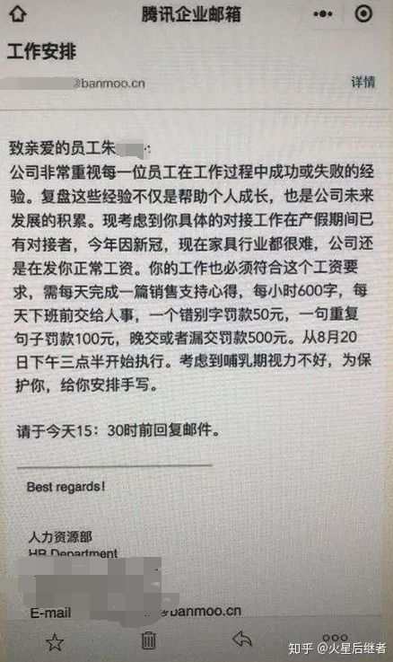
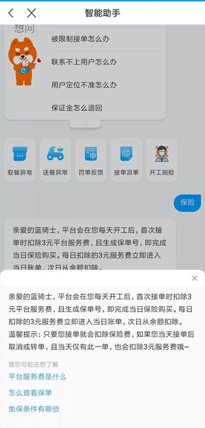
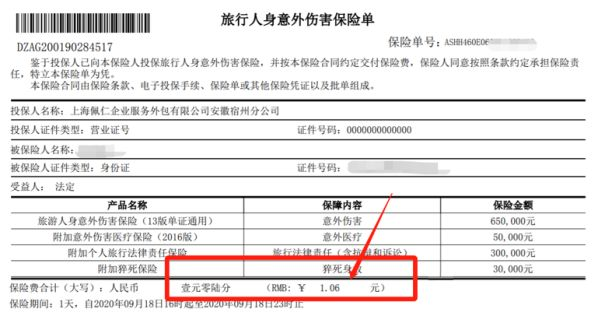
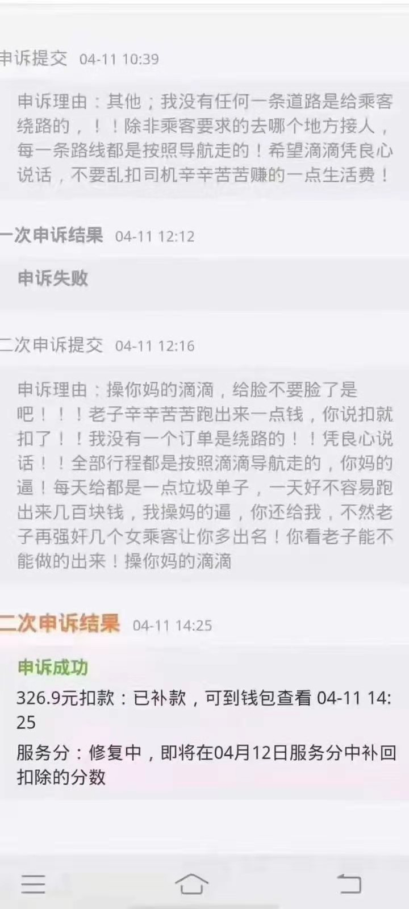
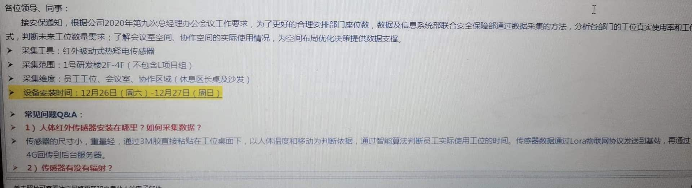
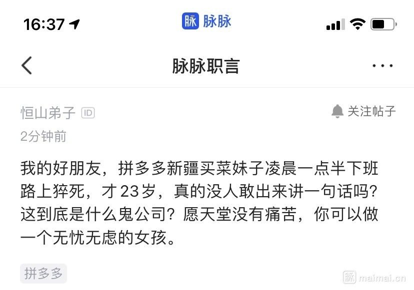
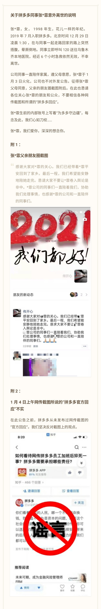
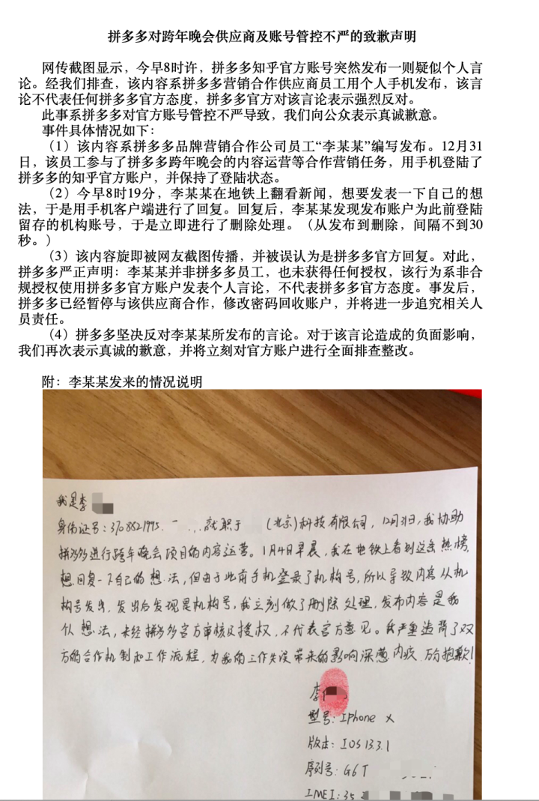

# 吃屎系列：资本家如何喂员工吃屎

## 前言

这里记录一些劳资纠纷中，企业如何欺压劳动者的新闻。

## Other Projects

其它一些记录劳动者被欺负的项目：

* [校招污点公司记录](https://github.com/ShameCom/ShameCom)
* [996icu/996.ICU](https://github.com/996icu/996.ICU)
* [fengT-T/996\_list](https://github.com/fengT-T/996\_list)
* [623637646/996.Leave](https://github.com/623637646/996.Leave)

## List

List里面的内容只是本人的一个草稿，一些细节未经过考证。

* Amazon
  * 没整理好，比较多
* Facebook
  * 华人员工自杀
* 有赞
  * 明目张胆实施996工作制
    * 接投诉30多起，杭州立案调查有赞公司“996工作制” [「原链接」](https://baijiahao.baidu.com/s?id=1624272494347206177\&wfr=spider) [「存档链接」](https://archive.vn/J9h2P)
* 华为
  * 臭名昭著的奋斗者协议
    * [百度百科：奋斗者协议](https://baike.baidu.com/item/%E5%A5%8B%E6%96%97%E8%80%85%E5%8D%8F%E8%AE%AE) [「存档链接」](https://archive.vn/Z4aOu)
    * [华为《奋斗者协议》被判有效 “家法”熬成“国法”](https://vct.news/news/663aed06-f29e-4b9e-9a4a-35ca2c3b74e6) [「存档链接」](https://archive.vn/auMVq)
    * [起底华为奋斗者协议](https://zhuanlan.zhihu.com/p/269379048) [「存档链接」](https://archive.vn/Itpqk)
  * 华为员工胡玲5千字控诉“研发累死累活，文员却莺歌燕舞” [「原链接」](https://chinadigitaltimes.net/chinese/2019/11/%E5%8D%8E%E4%B8%BA%E5%85%AC%E5%8F%B8-%E8%83%A1%E7%8E%B2%EF%BC%9A%E7%A0%94%E5%8F%91%E5%85%84%E5%BC%9F%E4%BB%AC%E5%AF%B9%E4%B8%8D%E8%B5%B7%EF%BC%8C%E6%88%91%E5%B0%BD%E5%8A%9B%E4%BA%86-%E4%B8%80/) [「存档链接」](https://archive.vn/huGVV)
  * 据红星新闻2日报道，近期，华为裁员的消息引发了各方关注，曾有人在华为内部沟通网站心声社区发帖称“目前华为中国区开始集中清理34岁以上的交付工程维护人员，而研发则是清退40岁以上老员工，主要针对程序员。”但目前，红星新闻记者已无法找到该帖。
  * 员工孕期结束以后，申请回到工作岗位。但是华为要求员工转岗，同时，在原来的部门里除掉了该员工的岗位，并且持续招人。问题来了，既然不需要岗位了，为什么要招人？ 如果需要新人，该员工为什么要被安排调岗？员工被调岗后暂时失业，经过多次申请，终于安排了两个新岗位。但是，新的岗位该员工完全不懂，没有相关经历经验。员工去申请新岗位，被新部门拒绝。自此，华为就终止合同，理由是协商未果。解除了员工的劳动合同，还以“本人意愿”的名义解除，导致员工连失业金都申请不到。
  * 36岁的华为工程师齐智勇，在肯尼亚遭遇过劳死。留下没有工作没有收入、独自带着两个孩子的妻子。 齐智勇从2017年1月到2018年10月，22个月都没有休假回家。即便是节假日，也要为了保障业务全天留在客户处值守。
  * 诬陷自己的员工，最终导致员工被羁押90天
    * [网曝华为前北非经理泄华为内幕 在泰国被中共抓捕](https://ozvoice.org/%E6%96%B0%E9%97%BB/%E4%B8%AD%E5%9B%BD%E8%81%9A%E7%84%A6/%E7%BD%91%E6%9B%9D%E5%8D%8E%E4%B8%BA%E5%89%8D%E5%8C%97%E9%9D%9E%E7%BB%8F%E7%90%86%E6%B3%84%E5%8D%8E%E4%B8%BA%E5%86%85%E5%B9%95-%E5%9C%A8%E6%B3%B0%E5%9B%BD%E8%A2%AB%E4%B8%AD%E5%85%B1%E6%8A%93%E6%8D%95/)
    * [因休假被辞退的华为员工-林夕-的二审上诉状](https://medium.com/@yangzhanqing6121328/%E5%9B%A0%E4%BC%91%E5%81%87%E8%A2%AB%E8%BE%9E%E9%80%80%E7%9A%84%E5%8D%8E%E4%B8%BA%E5%91%98%E5%B7%A5-%E6%9E%97%E5%A4%95-%E7%9A%84%E4%BA%8C%E5%AE%A1%E4%B8%8A%E8%AF%89%E7%8A%B6-bbfe071f0536)
    * [不止李洪元 华为又一前员工被羁押90天](https://finance.sina.cn/chanjing/gsxw/2019-12-02/detail-iihnzhfz3196220.d.html)
    * [专访华为前员工：不止李洪元，我也曾因离职赔偿被羁押90天](https://evil-huawei.github.io/evil-huawei/events/%E5%8D%8E%E4%B8%BA%E5%89%8D%E5%91%98%E5%B7%A5%E6%9E%97%E5%A4%95%E4%BA%8B%E4%BB%B6/)
    * [不止李洪元，我也曾因离职赔偿被羁押90天](https://archive.vn/VK2X5)
  * 诬陷自己的员工，最终导致员工坐牢251天 [华为251事件](https://zh.wikipedia.org/wiki/%E8%8F%AF%E7%82%BA251%E4%BA%8B%E4%BB%B6)
    * 从此华为又被称为“牢厂”
* 网易
  * [网易实行995：强制加班or变相裁员](https://zhuanlan.zhihu.com/p/75830797) [「存档链接」](https://archive.vn/3fxpF)
  * [离职拿N+1有危害？网易的HR和主管是这样劝员工不要拿N+1的](https://thefucking.net/netease\_hr\_talk/) [「存档链接」](https://archive.vn/P788D)
  * 暴力裁员
    * [人民舆情：网易暴力裁员 回应缺乏诚意 品牌受重创](http://yuqing.people.com.cn/n1/2019/1126/c209043-31474127.html) [「存档链接」](https://archive.vn/q6jhN)
    * [网易裁员 让保安把身患绝症的我赶出公司](https://finance.sina.com.cn/stock/usstock/2019-11-24/doc-iihnzhfz1405328.shtml) [「存档链接」](https://archive.vn/J5K6D)
* 腾讯
  * 暴力裁员
    * [腾讯HR暴力裁员，花式辞退7年老员工](https://thefucking.net/shenzhen\_tencent/) [「存档链接」](https://archive.vn/HoYWx)
    * [腾讯暴力裁员？官方回应：该员工严重违反劳动纪律](https://tech.163.com/20/0102/14/F1T2LJGN00097U7R.html) [「存档链接」](https://archive.vn/uS2Od)
* 阿里巴巴
  * 马云声称996是福报
  * [阿里员工求助：两次绩效3.25，开除没有赔偿，我该如何维权？](https://new.qq.com/omn/20200923/20200923A0ENAV00.html)
  * [阿里员工求助：两次绩效3.25，开除没有赔偿，我该如何维权？](https://dy.163.com/article/FN8OTF1905490OET.html)
  * [阿里巴巴月饼门](https://baike.baidu.com/item/%E9%98%BF%E9%87%8C%E5%B7%B4%E5%B7%B4%E6%9C%88%E9%A5%BC%E9%97%A8)[「存档链接」](https://archive.vn/LH6MW)
    * 这个合理与否或许有争议，但是HR权利过大对于程序员来说不是一个好事情
  * 入职阿里巴巴12年被指“不能胜任工作”，被裁员工获赔近30万
    * 何某某入职阿里巴巴（中国）网络技术有限公司12年，因绩效未达标遭解除合同，杭州市滨江区人民法院日前一审判处阿里巴巴公司赔偿何某某共计近30万元人民币。
  *   阿里员工自述，十年996后被辞退，无赔偿无离职证明。[阿里十年996是个什么结局?](https://zhuanlan.zhihu.com/p/62782492) [「存档链接」](https://archive.vn/XGXgh)

      天眼查披露的判决书显示，2006年3月，何某某入职阿里巴巴公司任客户经理，双方于2014年9月签订了一份无固定期限劳动合同。2018年4月20日，何某某因2018年1月1日至2018年3月31日的绩效成绩为3.25B，出具《绩效改进计划》一份，对其上期（2018年1月1日至2018年3月31日）绩效成绩也为3.25B，属于“不胜任工作"，阿里巴巴公司于2018年8月29向集团工会征求意见，工会亦对解除决定不持异议，决定何某某后工作日为2018年8月31日。此外，何某某拒绝阿里巴巴为其安排的培训，且在2018年4月1日至6月30日间也未达到绩效改进计划中的绩效要求，仍不能胜任工作
  * 有一位阿里员工在某职场论坛晒出了自己被辞退的经历，这位阿里员工今年35岁，有10年开发经验，过完年第一天上班，就被公司劝退，建议他这个月提离职，而被辞退的理由也是让他没想到，公司给的理由是他年纪较大，这位员工也是很迷茫，不知道接下来该如何维持生计。
* 字（xi guan）节跳动
  * “奉劝各位不要去字节跳动了”，怀孕在家的前字节员工控诉老东家持续骚扰。[「原链接」](https://zhuanlan.zhihu.com/p/140737658) [「存档链接」](https://archive.vn/q6jhN)
    * 离职之后，入职字节跳动的“后遗症”开始凸显。首先是一年竞业限制，几乎所有知名企业都不能去；其次是算错税，导致每个月少拿1/3的工资;接着是连续往竞品公司寄钓鱼包裹，让如今怀孕在家的她“听到快递电话就心惊”。最后是联系钓鱼包裹发件人，还遭到辱骂。
* 京东
  * 违法取消快递员底薪，收快递提绩效
  * 4月12日，刘强东在朋友圈发文表示，京东最近四、五年没有实施末位淘汰制了，出现了人员急剧膨胀，发号施令的人愈来愈多，而干活的人愈来愈少的现象。这样下去，京东注定没有希望，公司只会逐渐被市场无情淘汰。他表示，混日子的人不是我的兄弟！真正的兄弟一定是一起拼杀于江湖，一起承担责任和压力，一起享受成功的成果的人！
  * 另外，刘强东还就“996”发表了自己的看法，他表示，京东不会强制员工“996”或“995”，但是，每一个京东人都必须具备拼搏精神。
  * 有传闻称，一名京东被开除员工在公租房中自杀。死者曾经向京东贷款购房，离职时被要求一次性还清。
* 拼多多
  * 好聚，不好散。拼多多竞业协议过于苛刻。
    * [“逃离”拼多多](https://project-gutenberg.github.io/Pincong/post/0039aeeb446a3dd19fe1dd7c03a1ba0d/)  [「存档链接」](https://archive.vn/SoADn)
  * 有拼多多员工在脉脉上怒斥拼多多新推出的两班倒值班制度。所谓两班倒，就是早班从早上7点到晚上7点，晚班从晚上7点到第二天早上7点。996已经满足不了拼多多了，必须要27×7地值班才可以。而且这项制度不仅现在要执行，春节要执行，之后每一天都要执行。高层不说停，员工吐血也要干
  * 拼多多员工加班猝死，拼多多在公关时大肆造谣（详情见下）。
* 快手
  * 计时如厕快手厕所装计时器监控员工！ [「原链接」](https://new.qq.com/omn/20201027/20201027A09F5B00.html) [「存档链接」](https://archive.vn/dyxVB)
  * 快手创始人宿华、程一笑2019-6-18联名发布一封全员信,要求996
* 大疆
  * 程序员猝死，大疆称无加班文化，离职员工怒了：有加班考核而已 [「原链接」](http://www.kejilie.com/tmtpost/article/jYBnEb.html) [「存档链接」](https://archive.vn/DVOhi)
* 半木家具要求一名哺乳期女员工每天按一小时600字手写一篇销售心得，按8小时计算，每天需写4800字。
  * 
* 饿了么
  * 43 岁外卖员送餐时猝死，平台称「不存在劳动关系，只能给人道主义费用」
    1. 为了省成本，不给交社保
    2. 为了不担舆论压力，这风险转嫁给商业保险，而钱是外卖小哥自己交的
    3. 即便如此，外卖小哥的保险钱还是被克扣了！快递员每日需要交3元的服务费，但是只有三分之一左右（1.06元）拿去交了保险，考虑到可能存在虚挂保费的情况，这个比例可能更少。&#x20;
       * 
       * 
  * 1月11日，47岁的饿了么外卖员刘进因工资被克扣5000元，多次沟通无果后，在配送站前引火自焚。被送往医院后刘进称，“我不想活了，我活够了，太累了。”
* 上海撷果公司（这么小的企业能上List我是没想到的，只是操作实在是太恶心了）
  * 老板赵建民想违法裁员，给人下套开除张宇超，法院不认可，判决赔偿20万。
  * 于是老板把判决书带实名信息[发布到知乎](https://www.zhihu.com/question/435565456)，并且配引导性文字，意图网暴当事人
  * 广大网友不上套，把老板骂了个狗血淋头。
* 滴滴
  * 疑似找借口克扣出租车司机费用引发司机极端言论
  * 

## \[2020-12] 上汽乘用车在员工座位下安装传感器

有人在知乎上发帖提问，说上汽乘用车在员工座位下安装传感器，名义上是采集数据，但是有人指出早在2014年，上汽就开始使用芯片/指纹/WiFi等等加强考勤了。所以合理的推测，这只是考勤的技术升级。

随后上汽公司官方账号[发布声明](https://www.zhihu.com/question/436828678/answer/1653287465)：

> 关于题主的问题，还是由正主来回答比较好，以免引起大家的误会。首先，我们不会、也不赞同用这样的方式对员工进行管理，这次安装传感器是作数据采集试运行使用，试运行时间预计2周，过后将全部拆除。之所以安装传感器，是因为我们计划对部分办公环境进行共享办公的改造，增加小型会议室和相对开放的办公空间。通过类似停车场指示系统的方式，显示共享办公区域的使用状态，便于大家进行预约使用，这样员工和合作伙伴们无论移动办公或者预约会议室都会更加方便啦！每一名员工都是奋战沙场的勇士，雄鹰振翅九霄，飞跃沧海，理应无所羁绊。

然而其中漏洞很多，首先设备并不便宜，这样的设备，大规模安装，只用两周，感觉是个说不过去的做法。 其次，一般来说运行周期也应该在邮件中说明，但是邮件里只有安装事件，没有运行时间。 更奇怪的是，官方的回复下，出现了奇怪的景象：

根据用户“普利尼日”在01-01的回复：2021.1.1，18:14，目前一共96条回复就被折叠了12条，上汽怕是还没遇到过这种情况的危机公关吧…

也的确有很多人反映评论被折叠了。

同时，出现了很多三无用户或者使用记录很少的用户声援上汽，我只能说十分像水军。

对此，我觉得唯一合理的解释是，本来希望强化考勤，被发布到了网上，引起了讨论，成为了需要危机公关的事情。这个时候，只能编一个拙劣的借口出来糊弄大家，料想自己带节奏大家也不相信，于是公司内外找了一些水军。

## \[2021-01] 拼多多员工猝死事件

拼多多有员工猝死了。

员工猝死本身不是特别大的新闻，前段时间商汤也有一个员工猝死，但是大家没说什么，主要还是普及健康安全知识。因为商汤的员工是在公司的健身房锻炼后猝死的，或许也是过劳死，但是这个劳不全是工作压力。

这次猝死的员工特别年轻，1998年出生的一个女生，而且下班时间特别晚，是凌晨一点。这就让同为无产阶级的同志们特别伤心和愤怒。

[作者：匿名用户](https://www.zhihu.com/question/437702180/answer/1658887340)

> 经前同事认证，妹子是凌晨一点半下班路上晕倒猝死的，她男朋友还发了朋友圈，98年的独生女，很漂亮，唱歌很好听，还有同事和她对接过，对她评价很高。说出姑娘的情况，希望每个知道这件事情的人，都可以给姑娘一个祝福和祈祷 人间不值得，希望天堂没有加班，希望姑娘可以开启新的人生。也希望姑娘的家人能够节哀，带着姑娘的希望继续好好生活。同时，拼多多需要给姑娘父母一个交代。我第一时间联系了同在新疆买菜的前同事，对方回复非常官方，说此事件是造谣让大家不要传谣。证实拼多多内部已经启动了保密措施，拼多多，这时候还试图掩盖事实真相，不要以为无法无天没人没机构监管。拼多多用尽手段逼迫员工转岗去买菜，强制辞退不愿去买菜的员工，买菜一线员工全年无休超负荷工作，这些都是事实，真相迟早有被揭开的一天，这些丑陋恶劣的行径都会曝光的阳光下。只是，我特别心痛，丑陋被揭露的同时，竟然是以这样的代价，一个年轻的23岁女孩的鲜活的生命！拼多多的负责人，各级主管，人事负责人，请问你们能够心安吗，午夜梦回，你们是否会为自己的所作所为忏悔，你们能听得到姑娘对这个世界的留恋吗。如果有地狱，你们一定会去那极恶的第十八层！希望姑娘的家人健健康康平平安安好好生活，并通过相关机构维权，拼多多必须给出说法和赔偿，虽然赔偿不能换回姑娘的生命，但这是她曾存在于这个世界的证明。逝者安息，生者坚强！

在这个问题下，拼多多官方回答了问题，语气特别冲，以至于我们怀疑这是潜伏在拼多多内部的友军：

> 你们看看底层的人民，哪一个不是用命换钱，我一直不以为是资本的问题，而是这个社会的问题，这是一个用命拼的时代，你可以选择安逸的日子，但你就要选择安逸带来的后果，人是可以控制自己的努力的，我们都可以

30秒后就删除了回答，但是仍然被手快的网友截图了。

随后拼多多发长文回应员工离世：「我们心痛如绞，我们爱你，深深的想念你」。在回应中，声称大家的截图是造谣，还附上了死者父亲的朋友圈：

可惜的是，终究是心急了一些，死者父亲的朋友圈是带“删除”的，而且发布2分钟以内就截图了，说明这个很可能是拼多多公关指使死者父亲发布的。 这还都是小事，晚上18:22，[知乎官方打脸拼多多](https://www.zhihu.com/question/437783708/answer/1660566169)：

> 「拼多多」系知乎注册用户，其身份真实无误。知乎有严格的身份认证流程和机制。 4 日 8 时 19 分 49 秒，「拼多多」创建回答「你们看看底层的人民，哪一个不是用命换钱，我一直不以为是资本的问题，而是这个社会的问题，这是一个用命拼的时代，你可以选择安逸的日子，但你就要选择安逸带来的后果，人是可以控制自己的努力的，我们都可以」。 4 日 8 时 20 分 17 秒，「拼多多」自行删除了上述回答。

我只能说：“精彩！”

随后在30分钟后，拼多多官方把锅扔到了外包的头上：

30分钟，就拿到了外包公司员工按着指纹的，和审讯记录一样的道歉信。

到此事情告一段落，但是已经没有人再相信拼多多说的任何一句话，可以说这是相当失败的公关，堪称灾难。

中央政法委长安剑公众号发文，声称把拼多多员工猝死问题泛化为社会的问题是“吃人血馒头”，“大肆表达自己对社会的不满”，是“陷入道德的泥淖”，同时声称，“拼多多也为人带来了‘多多的’快乐”。

详情参见原文：

* [微信原文链接](https://mp.weixin.qq.com/s/ICKGR5yyfhXvD18o2A3Qaw)&#x20;
* [备份链接](https://archive.vn/s38mo)
