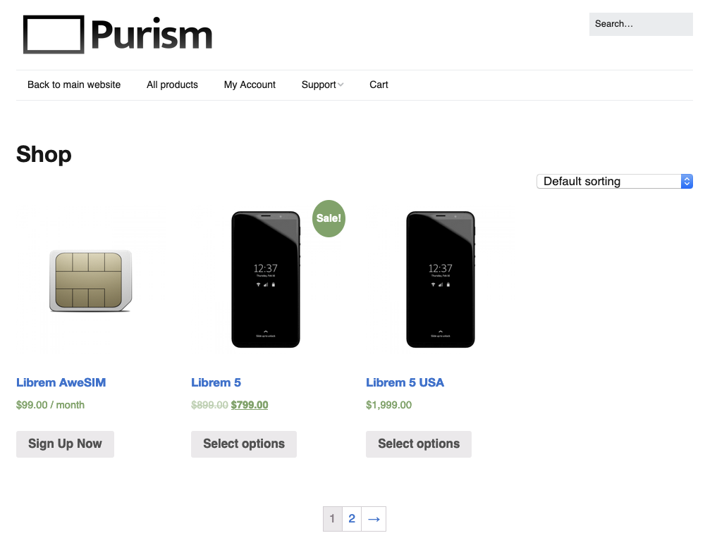

# 为什么不应该用国产手机

## 写在前面

这里的国产手机泛指未经Google认证的国产安卓系统手机，并不是指所有Made in China的手机。 事实上，Made in China很有竞争力，有一家厂商推出了一款手机，同时提供纯美国制造的版本，纯美国制造的版本要比世界协作的版本贵一倍：

我今天要说的主要是在中国开发的操作系统，有何问题我会稍后一一列出。

在此之前，可能会存在这样的疑问：**“如果软件有问题，那就刷机换系统不行吗？”**

当然是可以的，但是手机和电脑不一样，硬件是高度定制的，对应的固件和驱动程序（HAL/硬件抽象层）大多是私有的，这就决定了你不能随意的刷机。而且如果刷机换系统，甚至只是获取Root权限，你的保修可能就没了。

虽说存在诸多的限制，但是大家仍然有有限的自由：

1. 论坛的大神会放出各种破解版，修改版等等
2. 同一系列的手机不止在国内销售，在国外销售的系统会使用Google认证的原生Android。
3. 有一些厂商会开源底层的固件驱动，当然一般是旧型号的手机

但是国内厂商并不乐意你这么做，以笔者以前用过的魅族15为例，魅族15的国内国外销售的手机硬件完全一样，我出国以后希望刷Google原生系统，但是失败了，起初我以为是硬件上的问题，直到我看到了另一个刷机教程才知道我肤浅了，魅族往手机的ROM的某一处写了一个ID，这个ID可以用来区别这是在国内还是在国外销售的手机，由此决定手机是否可以刷国际版ROM。

想要用上国际版ROM，先得获取Root权限，执行一个脚本修改这个ID才行。

[刷机教程在这里](https://www.bokezhu.com/2020/02/27/632.html)，但是这不是我当时看的一篇，现在魅族论坛上所有关于国际版ROM的讨论都被魅族官方和谐了，可见魅族官方并不希望大家刷国际版ROM。

为什么魅族官方这么不想大家刷国际版ROM呢？因为用国产的ROM对魅族更加有利。国际版的ROM需要过Google的认证，除了国内有GFW，导致Google的原生程序使用不便以外，厂商不能肆意的往系统里塞东西，这里的塞东西是中性的，既指为了用户体验而定制的良好设计，也指广告程序，用户数据收集和各种内置后门。

## 广告多

广告和推送多，是不想用中国版Android系统的第一理由。 我自己以前统计过，魅族有11处广告，而且没法全部关掉，详细可以看这个视频：[Flyme去广告 Flyme系统自带的广告太多了](https://www.bilibili.com/video/BV1eb411E7oU)。

* 音乐，视频播放器让你开会员，给你推各种各样的歌和视频。
* 日历也不老实，什么星座运程，热门，“礼包”，球队比赛新闻，引导你去别的地方
* 浏览器自不必说，默认的空白页变成了类似2345导航网站的页面，你的每个点击都在贡献CTR，最后变成钱。
* 手机管家里面也是一堆广告，安全播报，应用推荐下载
* 连壁纸里面都有有，推送节日壁纸我可以理解，为什么壁纸程序要“精选内容推送”啊？
* “资讯”就更不用说，整个就是一个大广告软件，配上一大堆UC震惊标题新闻。
* 即使你都关闭了，还有推送

我当时为什么买魅族呢？说来好笑，同样性价比的有魅族和小米，我知道小米广告多，业内素有广告米的名号。我前一部手机是魅族MX3，那个时候大家还不会塞广告，我的体验相当不错。 加上MX3从外观到UI设计的真的很漂亮，所以买了魅族。

可是看到这么多广告，我也算对魅族彻底死心了，准备刷个国际版，这辈子不再买魅族了。在我准备刷魅族的最后关口，魅族手机不幸掉海里了，我干脆买了Google的Pixel，这是后话了。

广告也是历史悠久了，很早以前的国产手机（非智能机）除了开屏广告以外，还会内置一些删不掉的，需要交钱才能玩的小游戏，或者是一些订阅收费彩铃的入口。

## 权限控制弱

小米的照明弹算是对流氓App打响了第一枪（居然是广告米！）。

国内的软件，大多权限要的特别多。 这里都不说脉脉这种不读通讯录就不给用的流氓，很多软件，就算你不给权限，也有办法旁敲侧击的获取。 比如你不给应用列表，那就挨个尝试启动，比如尝试启动微博，启动成功了你肯定装了。再比如有文件夹读取权限的，就去读闪存里面有没有Weibo的文件夹，来判断你装了没有。 GPS的权限没有，但是如果能读取照片文件，就用照片里的GPS信息。 诸如此类，不胜枚举，你的一言一行，都被扒的干干净净清清楚楚，这些数据送到公司去，机器学习给你安排的明明白白。

定期收集的数据，通过流氓一般霸占在后台的进程发送到公司的服务器，然后用这些数据生成用户画像，以后给你推广告。

自从2010年，GFW屏蔽Google以来，Google的统一推送服务在中国是不能使用的，于是每一个应用程序都要启动一个后台服务来接受消息，顺便上传一下采集到的用户数据。很长一段时间，Android手机的内存几乎一直比iPhone要大，电池也大，但是没有iPhone流畅，电池也不耐用。 原因之一就是后台程序太多，占用内存太多。为了续航和流畅度，手机厂商想尽办法杀进程，App就想尽办法防杀，什么注册服务、自启动链，小小的手机里，天天都是攻防战。 当然，一部分和手机合作的软件厂商就可以获取更多的权限，来保证手机的正常运行。

这也不是国产系统的问题，这算是Android的通病，但是这个问题在国内更加严重. 因为Google离开中国以后，Android缺乏统一的推送机制,加上国内厂商大多是Fork一些非最新版安卓的源代码加一层壳改造开发，一些最新的权限控制更新也不能及时应用。

## 你的手机不是你的手机

最近，V2EX上有爆出了VIVO的手机存在后门，会将自己当作mCDN使用：[Vivo 手机某系统进程开放 55555 端口疑似用作 mCDN](https://www.v2ex.com/t/778678)。 同时还爆出系统内启动快应用不用伪协议，而是启动一个HTTP服务器，监听端口，而且还将这个端口通过uPnP暴露到公网上，几万台手机可能就会变成肉鸡。

可以看出，手机厂商已经不满足于给你推送消息，你购买的手机，将会变成手机厂商的分布式数据采集和计算设备，而你除了要付手机的费用，手机卡的费用，网络的费用，还得充电供着，不允许自己刷机或者Root，刷完软件就连硬件都不保修，就算你不要保修，他们也会通过设置一些标识位，防止国内的用户用上无法让他们赚钱的国际版系统。

这也不是近几年才有的新鲜玩意儿，早10年，安卓爆发的前夜，有很多山寨机就会偷偷发短信去“订阅服务”来赚钱。

## 国外的月亮是不是更圆

要圆一些，但也不是那么圆。 苹果也好，Google也好，也都在收集你的数据，苹果曾经为了刺激用户购买新的设备，以电池老化为理由，给旧设备降频，你的手机感觉更慢了。 但是至少：

* 推送是统一的，不至于费电
* 权限管理，尤其是通知管理是严格的，App不至于出现群魔乱舞的状态
* 系统App里面是没有那么多推送和广告的，系统是纯净的

归根结底，所有的资本都想做恶，但是在欧美日本这些国家做恶的成本太高了，让这些厂商不得不收手。

## 开源的手机是不是智商税

是，也不是。买开源手机之前，你一定要知道你买了一个什么。 大多数的开源手机都是一个ARM64的主板，基于Linux操作系统定制的开源系统。 而Linux操作系统是几乎没法运行iOS或者Android的手机软件的（当然Android模拟器是一个选择，但是实在不算一个好选择，或许可以试试看这个：[https://anbox.io/）。](https://anbox.io/%EF%BC%89%E3%80%82) 而且同等配置下开源手机会更贵，道理也很简单，产量不够，系统开发，手机设计，开模的成本分摊到每一个手机上就更高。

但是另一个角度来说，你失去了手机的软件，但是你获得了几乎所有电脑端的软件，你的手机可以运行Python，GCC，乃至几乎任何能在你的桌面端Linux跑起来的软件（只要内存够）。

作为在中国使用的手机，可能绕不过去微信，QQ等软件，选开源手机基本意味着智商税，但是如果你需要一个备用机，或者你是一个开发人员（或者运维），用手机可以在出差或者旅游的时候解决一些问题的话，可以买一个，就当买一个超小型电脑，而且Telegram，Twitter，Mastodon之类的服务都可以照常使用，娱乐问题也不大。

## 如何选择手机

* 不愿意折腾的，或者没有技术折腾的，选iPhone。
* 能翻墙的，选原生Android机（Google Pixel这样的），或者能刷成原生Android/其它你能控制的纯净一些的Android系统的手机。
* Linux开源手机不适合在中国日常使用，但是可以作为备用机。

顺便一提，我很期待Windows的手机（虽然期待Windows的手机，但是我对Windows的印象仍然很差，尤其是强制更新这一项），Windows应用商店生态能够勉强支撑日常使用，如果ARM能够高效转译执行x86的指令集的话，生态上就是无敌的存在了。
