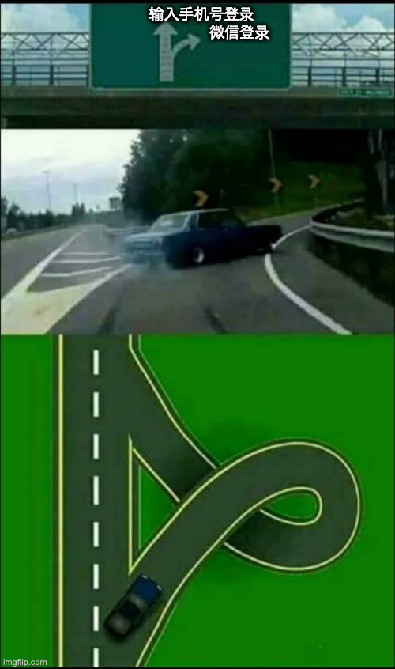
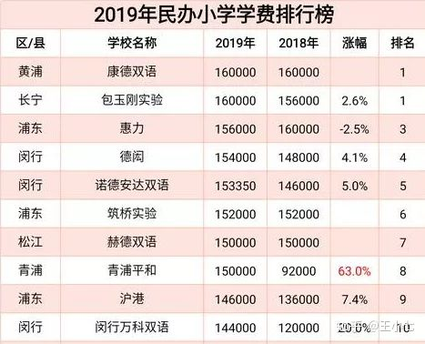

# 杂谈

## \[2022-08-09] 吐槽一下国内的数据竞赛平台

本来不会参加任何竞赛的了，但是和同事在讨论项目方案的时候，同事提到某个竞赛的Top1方案不错，于是我准备去登录一下这个系统然后下载数据复现一下。

于是我就遇到了[datafountain](https://www.datafountain.cn/)。

首先得登录，问题不大，我看到输入手机号和微信登录，果断选择微信，结果微信连接完又让我输入手机号。

这都是小事，不就是给白嫖了微信号吗？给他！

于是我输入手机号，给我发了个验证码，我悲哀的知道以后收到的垃圾短信里有一份datafountain的功劳。

我准备下载数据，先是同意协议参加竞赛，没问题！

当我点击下载数据的时候，datafountain让我填写少许的个人信息：

- 生日
- 居住地
- 学校
- 专业
- 学历
- 入学时间
- 毕业时间
- 职业经历
- 职位
- 所在行业
- 技能方向
- 姓名
- 身份证号

以上都是必填信息，少写一个都不给过的。

填完信息，我开始下载数据，我满心期待，我交出了我所有的个人信息，我现在对datafountain已经是赤身裸体的状态了，毕竟我爸妈都背不下我的身份证号。再说，毕竟是**中国计算机学会**举办的比赛，数据也应该是很有价值。

结果从数据大小我就开始感觉不对劲儿了，测试集30M，训练集60M不到，一看，只是挑选了某个大数据集的一个子集。

子集就子集吧，能用就行。下载完所有的文件，我发现标签文件和下面的数据简介对不上，还缺一个文件死活找不到。那么使用方式就只能靠猜了。

本来吐槽企业随便拿点自己的生产数据，然后把自己懒得解决的问题扔出来来举办什么数据竞赛是不太体面的行为，现在看来，前者好歹有实际应用背景，大部分企业还是能做好数据脱敏、清洗和整理。

而这次遇到的竞赛，则是彻底击穿我所看到的下限。

## \[2021-06-26] （转载，来源丢了）教育能否改变人生

很多人认为自己的命运是被高考改变的，这种看法完全错误。

真正改变命运的就两件事：

1、全球化。

2、城市化。

很多人就是喜欢把自己的成功归因于个人成功。但是没有这两条，全给你考上清华北大有用吗？

美国1929年大衰退，哈佛的开电梯都多的是，开电梯都是不错了。

而且一定要明白一点，你看起来阶层上升了，但是大多数人在全社会的总排名没有变，只不过原来你们家在村里一年多吃一顿肉，现在你在上海可能多了一套房，你觉得阶层上升了，其实并没有，社会总排名不变。

但是，升老师不是说这没有意义，相反这非常有意义，你要排名没有用，蛋糕做大了，他开法拉利，你开丰田，这才是真正的价值。’

就是教育本身，也受益于这两点，让教育公平很多，大家回忆一下，你的上一代考上大学的有多少人，考上的是不是都是安阳师专，常熟师范，能考上个大专就祖坟核爆炸了。

现在你考上了985 211是你比上一代人能吗？不是，因为扩招了，为什么扩招了，因为城市化，因为全球化，需要更多有文化的人了。

这不是教育本身能做到的。

还有一点你要感谢的，是你的父母，给你了一个不错的社会总排名。

至于以前的大学生，考试上的有改变命运的没有，但是以前除非是天才，考大学是要反复复读的，俞敏洪考了三年，马云也考了三年，实际上就是升老师以前说的，如果你把高中延长到5-6年，最笨的人也能考上北大。

但是呢？什么家庭能支撑一个青壮吭哧吭哧读三年书不干活。你说应不应该感谢的你父母的排名。

“寒门出贵子”，这件事，从一开始就理解错了。

什么是寒门？

寒门又叫寒族，也就是庶族，对应的是士族，寒门是跟高门对应的，这是魏晋兴起的概念。

高门是大地主，大官僚，你祖上差不多从汉代一直是官宦，注意，没有断过，那你是士族。

你要是断了，有几代没有当官，是寒门。或者说，你后来自我奋斗，终于成了中小地主，好了，你算个寒门。

看见了没有，这里都是地主，没有农民的事，甚至没有商人，没有手工业者的事。

所以寒门是谁，曹操他家是宦官出身，后来做到太尉，他还是寒门。

不是说没有高考，是有高考，这个路子也一定不是你的，寒门出贵子，怎么办呢？

走军事路线，所谓的将门。

不要觉得将门很好听，在高门眼里将门是骂人的。

司马懿他家也是寒门，只不过从他这两代起开始好转。后来司马炎当皇帝，跟他的妃子胡贵嫔玩飞行棋，结果胡娘娘把司马炎手指抓破了。

司马炎骂她：你他妈真是个将种。意思是你家是武将之后。

结果胡贵妃也不客气：说我爹北伐公孙，南拒诸葛，我当然是将种。

什么意思呢？我爹当武将，都是跟着你爷爷司马懿，不是打公孙渊，就是干诸葛亮，我是将种，你他妈也是将种，你全家都是将种。

司马家就是寒门，只不过就是后来掌握了话语权，给自己在史书里给自己加了四个字“服膺儒教”，啥意思呢？我们虽然是将种发家，但是我们也是文化人啊，相当于领导干部进修北大博士。

所以寒门从一开始，就不是真的底层，它应该换个名字，叫”新贵“，换到今天，你得是知名企业家。新贵出贵子，你就能理解了，新贵本来就能出贵子。

而且新贵也要拼，为啥还有个军事路线给你呢，因为打仗要死人，人家士族不想死人，所以你打仗能出”贵子“。

这就是为什么豁出命去，能出贵子。一张考卷就改变命运的事从来没有，你觉得你是分酬，人家那是血酬。

这不是说魏晋没有考试是这样。后来有考试也是这样。

宋代的科举，产生了不少科举世家，只要有一个人中了，后代就容易中了。为什么？人家有家学啊，考试技巧，作文思路啊，这点你在学校里学不到，只能老子教儿子。

你看《儒林外史》就明白了，当然你光看一个中学课文节选《范进中举》你看一辈子也不明白。

范进为啥能中举？不是因为他老丈人是屠户，屠户有点小钱，是个中产，有点这个原因，但这不是全部，范进中举是因为周进。

周进做了广东学道，才让范进中了秀才，而且跟他说了一句话，说你只要考举人，一定能中的。

范进这个人的文章是好的，但是，他过不了秀才这一关，因为他适合过举人这一关。明白什么意思吗？

升老师给你说明白一点，就是过秀才这一关，需要秀才这一级的好文章，过举人这一关，需要举人级的好文章，过进士这一关，需要进士一级的好文章。而这三种文章，是不一样的好文章。

范进的老师周进，就是卡在了举人这一关，所以考到54岁，还是一个秀才，童生，因为他擅长的是进士级的好文章，范进这个人，他卡在了秀才这一级，但他其实是举人级的。

这就是教育的吊诡。

这才是《儒林外史》要告诉给读书人的，这个道理，升老师不给你讲，你能明白吗？你读一辈子四书五经，滚瓜烂熟，出不来的，因为掌管你命运的，选秀才你都过不了。

但是人家家学有啊，考秀才怎么过，考举人怎么过，甚至哪个主考官，喜欢什么文章，门儿清。

《儒林外史》里有个出书的，叫马二先生，他出什么书，出《五年高考，三年模拟》，那个时代的高考公考辅导书，但是马二先生这个人，考了很多年举人，没考上。这就相当于，一个高考失败的人，来给你讲高考，他能提供什么经验，他只能提供考童生的经验，还有考举人失败的意见，但是你要考的是举人啊。

这是不是就是今天的高考课外辅导，公考辅导，都是没考好的人给你讲，你掏几万有用吗？没用。

所以后来一个高翰林说出了科举的诀窍，你看四书五经没有用，你要琢磨主考官的文章，琢磨他的喜好。

翰林都是进士出身，这才是真正的考试技巧。

所以你明白，为什么《红楼梦》里，贾政给儿子娶媳妇，第一个儿子娶的是国子监祭酒的闺女李纨，第二个儿子贾宝玉，要娶的是，探花郎的闺女林黛玉。

你明白为啥薛宝钗、史湘云这些人，总劝贾宝玉要科举，林黛玉从来不劝吗？因为人家家是真考过的，其他人劝也是瞎劝，知道你天天K书也没有用，高考不拼那个。

古代的翰林，都是穷官，但是翰林的闺女从来都不愁嫁。

改变命运，是靠考试吗？是靠教育吗？

所以，教育不是改变不了命运，是从来没有改变过命运。

## \[2021-04-11] 肇事逃逸

来源：[你见过最恐怖的事是什么？](https://www.zhihu.com/question/352776383/answer/1753797237)

没想到有这么多人看哈哈哈哈，虽然但是我是个姑娘！！！！有好心人帮我爸说话说的是“自己的儿子”！！

—————分割线以下原回答。

车祸，我是被撞的那个。

那天我新买了一台笔记本电脑，苹果的，m1芯片那个，超级开心，用那台电脑在自习室认认真真的看了一下午网课，从3点看到晚上10点，就中间恰了个饭算是休息。

自习室离家要经过三个十字路口。

我是骑哈啰助力车回去的，macbookair很轻，我图背去自习室省力。

在倒数第二个十字路口那边，我直走，他右转。

我也不知道这个哈皮是拿刹车当油门了还是咋，速度之快以至于我躲都躲不开，啪的一下我就被撞倒了，很快啊，我的助力车也飞出去了。

就在地上翻滚了一圈，整个人都是懵的，我特别害怕我的笔记本坏了，我才刚买了一天。

这辆车是超速了，我直走的时候眼观六路耳听八方都没看到我身后有辆大众。

好家伙我当时甚至没有什么痛感，撞我的一瞬间根本不是疼来形容，可以说是恶心。

好在我福大命大，没啥大事，那个时候十字路口有个好心人开车把我送去医院了，在我爸来之前陪我做检查啥的都是这个好心人，骨头没事，没有什么皮外伤，就是有一处伤口里面的肉坏掉了，需要割掉缝针，不然会感染。

急诊室里还有另一波，那天晚上我病床旁边的哥哥就有点惨了，是被刀子捅了，在外面等我的好心人把耳朵竖得老高偷听是为啥被捅，好像是捅他的喝高了又被言语激了。

其他的只需要身体自己恢复就好了。

当天晚上睡觉的时候痛感就来了，不能翻身，早上四五点被疼醒，但是很奇怪，车撞的是我上半身，我的疼痛全集中在下半身，那段时间我的腿没有办法直立，脚踝那边一用力就疼的嗷呜嗷呜的。

就这样为了带去自习室学习而买的macbook，成了我在床上看网课的工具（早知道买个败家之眼）

那天晚上我真的以为我要没了，被撞之后暖流一直在我心肺那边，我以为我肺泡炸了，动脉破了，我打电话很平静的告诉我爸我肺泡炸了，我动脉应该裂开了，我要是没了你们就再生一个。

我爸气的说你肺泡炸了你早没了。

那天晚上我爸也很好玩，最颤抖的语气说着最硬的话，来医院的时候眼睛都红了说话都颤抖了，把好心人垫的医药费还给人家之后我爸觉得高低得送点啥，我爸车上啥也没有他兜里的烟也就剩半盒了，他一着急把车里的玻璃水跟人家了，给那个好心人逗的。

以上是happy ending 了吗？

不是，我和我爸都觉得人没事就是万幸，准备第二天报警，撞我的人把我撞了就跑了，我和我爸也不想追究逃逸的责任，就寻思赔个医药费就完了，就算是赔钱这东西交强险

三者险都能报，赔也是保险公司赔。

想不到叭第二天下午我接到了交警队的电话，他们说我肇事逃逸

，因为人家撞我我车坏了。

e克丝q丝蜜？

我问“我不懂啊这怎么算逃逸。”

他说“车主前保险杠坏了是因为撞你撞坏的，你当时没报警直接离开案发现场就算逃逸。人家要是不谅解你你还要被拘留，我不是跟你开玩笑”

我问“这怎么还上升到拘留了。”

他说：“你不懂是吧，没事，我会让你懂的。”

我一直很愿意相信公权力的。

直到那天，我脊背发凉，发现气冷抖根本不是一个梗，是一个很真实的身体反应。

后来也懒的阐述怎么解决的了，好在那天电话我录了音了，我爸交警队有很好的朋友，交警一开始说那边没监控，我爸的朋友给我们调了监控，又换了一组人给定责，车主全责。

倘若这个我爸和这个朋友不认识呢？

我又该怎么办。

编辑于 2021-06-09 23:46

## \[2020-12-04] 冲塔趣闻

有人问了个问题，“各种语言有些什么书写奇葩的单词？”，有人回答：“众所周知，“卤”是洗手液的意思。”

又有人回复，难道不是打废了的坦克吗？ 这个时候有人发了个：“点点点点点人？”暗喻六四事件的那张著名照片：

随后评论区就被关闭了。 哈哈哈哈哈哈哈。

## \[2020-10-19] 假如高考改为全国统考

不用假设，19年前就是一张卷子，连分数都没有按区域矫正过，真正的公平竞争。

来源：[https://www.zhihu.com/question/52992122/answer/207896783](https://www.zhihu.com/question/52992122/answer/207896783)

说一个和自己工作相关的有趣案件。

2001年的时候，高考还是全国一张卷，分省录取。当年北京文科重点本科录取分数线为454分，一般本科429分，专科360分；山东文科分数线则夸张地有些离谱，重点本科录取分数线为580分，一般本科539分，专科为509分。分差竟然到达近130分，山东的专科分数线都比北京重点本科高55分。理科同样如此，山东理科重点线高达607，而北京只有488。注意，这是同一张试卷。这事儿吧，也怪当时山东省考试院教育厅办事不密，没用标准分

，直接用了基础分，直接显示出考试原始真实成绩（注意用标准分是不知道的）。

山东青岛三名当年参加高考的考生——这三名考生分别是青岛铁一中
高三四班姜妍(理科，高考成绩522分)、青岛一中高三四班栾倩

(文科，高考成绩457分)和青岛15中高三九班的张天珠(文科，高考成绩506分)，由于未能达到山东省当年的重点大学的分数线，甚至连专科线都没达到，别说上大学了，只能复读或者去职业技术学校。

不知咋的，这三个考生竟然做出了个什么有趣的时期，他们决定运用所学知识为自己维权，他们不是专业法律人士，但宪法里面那条：公民享有平等的受教育权还是知道的。于是，他们搞出来个大新闻：山东三考生向最高人民法院状告教育部违宪。

2001年8月23日，他们分别委托律师，以邮寄方式向最高人民法院起诉教育部侵犯了公民平等的受教育权。理由是，由于教育部以制定招生计划的形式，造成了全国不同地域考生之间受教育权的不平等，尤其是北京地区的高考录取线大大低于全国平均水平，比山东低100多分。考生的诉讼要求是请求最高人民法院确认教育部所作出的“关于2001年全国普通高校高等教育招生计划”的行政行为违法，并向教育部发司法建议书

，以避免今后再发生类似的行为。当时还开了一个小型的新闻发布会。

其实吧，这三考生一开始就没准备和教育部硬刚，他们也不敢硬刚，也刚不出结果，也不可能有结果，此例一开的话，后果不堪设想。他们一开始的目的就是为了引发媒体关注，搞出个大新闻。所以他们才会直接把案子告到最高人民法院。按照司法程序，他们应该先走地方中级法院。

果然，９月３日，最高法院告知他们：根据《行政诉讼法

》第十四条第二款规定，对国务院各部门或者省、自治区、直辖市人民政府所作的具体行政行为提起诉讼的案件，由所在地中级人民法院受理。也就是说，３位当事人应该到北京市一中院起诉。鉴于以上原因，诉状寄回。

到了北京 之后，三个学生的思想相对有点动摇，还是不敢直接刚教育部，她们有许多的担心，毕竟 还担心将来的生活会受到影响。将来的学习会受到影响，包括毕竟她们知道这次不能通过这次事件，然后另行找到一个学校来上，所以她们有可能要复读，有可能要到职业学校进行学 习，又担心教育部门将来会对她们的 学习生活造成影响。

后面就是阴谋论时间了，有人说教育部去做工作了，有人说教育部施压了。9月8日，三考生撤诉，不在上告青岛二中院。

这个案件宪法学里面还蛮有名的，也蛮有趣的。

后续，2002年高考取消全国统一命卷，开始分省自主命题。

- [状告教育部侵犯平等受教育权 青岛考生进京递诉状](https://edu.sina.com.cn/l/2001-08-23/14601.html)
    - [Archive](https://archive.ph/mfwsC)
- [教育部酝酿改革 青岛三学生停诉侵权](https://edu.sina.com.cn/l/2001-09-09/15758.html)
    - [Archive](https://archive.ph/6iSdR)

### [高考录取分数线悬殊太大!青岛三考生状告教育部](http://news.sohu.com/17/76/news146347617.shtml)

中新网济南8月23日消息：要状告教育部的三名青岛考生与其代理律师昨日一起乘飞机赶到北京，23日上午，考生们将向最高人民法院递交诉讼状。

据齐鲁晚报报道，这三名考生分别是青岛铁一中高三四班姜妍(理科，高考成绩522分)、青岛一中高三四班栾倩(文科，高考成绩457分)和青岛15中高三九班的张天珠(文科，高考成绩506分)，她们三人将分别向教育部提起行政诉讼，诉教育部所作出的关于2001年全国普通高校高等教育招生计划的行政行为侵犯了她们的平等受教育权。

张天珠说，她是在8月初高考录取分数线划定以后有了这个想法的。在青岛，文科专科提档线是509分，一般本科是539分，重点本科是575分，而北京的重点本科提档线是456分。两地分数线差别悬殊，她觉得不公平。

其代理律师李强和杨培银认为，教育部根据不同地域范围对招生人数做不同限定，这种限定使得不同地域考生被划分成高低不同的等级，并在不同等级中参加高考。等级之间分数标准线差异巨大，从而直接侵犯了包括三名原告在内的广大考生的平等受教育权。

两位律师说，考生的诉讼要求是请求最高人民法院能向教育部发司法建议书，以避免今后再发生类似的行为。(李艳)

### [新闻追踪：青岛三考生告教育部违宪诉状(全文)](http://news.sohu.com/42/01/news146510142.shtml)

《高考录取分数线悬殊太大!青岛三考生状告教育部》在搜狐登载后，引起网友的普遍关注和热烈讨论。尽管至尽还未有结果，但我们将会继续对这件事和中国教育改革予以关注。现将“青岛三考生告教育部违宪诉状(全文)”登载，以飨读者。

行政诉讼状

原告：栾倩、姜妍、张天珠（注：实际三人是三份诉状，为简化写在一处）

个人情况略

诉讼代理人：李强，山东德衡律师事务所律师

诉讼代理人：杨培银，山东德衡律师事务所北京分所律师

被告：中华人民共和国教育部

住所地：北京市西城区大木仓胡同37号

法定代表人：陈至立，部长

诉讼请求：

１、请求法院判决被告所作出的关于2001年全国普通高校高等教育招生计划的行政行为违反\[中华人民共和国宪法]和\[中华人民共和国教育法]的有关规定；

２、请求法院向被告提出司法建议书，促使被告以后避免作出类似违法行政行为。

事实和理由：

一、被告是具有国家行政职权的机关，并且作出了违法行政行为

被告作为我国最高行政机关的下属机关，具有对我国的教育包括高等教育考生录取进行管理、监督的行政职权。依据这种行政职权，被告在2001年4月16日作出了关于2001年全国普通高等院校教育招生计划的行政行为，该行政行为是以教发（2001）23号一个“通知”的形式作出的。

依据《行政诉讼法》以及最高人民法院关于\[执行《中华人民共和国行政诉讼法》若干问题的解释]，被告的行政行为与现行宪法直接相冲突，侵犯了宪法赋予公民平等接受教育包括高等教育的基本权利。

中国是社会主义的民主国家，这一点在制定宪法时体现得尤为明显。作为中华人民共和国的公民，原告从来就很自豪。因为我们的宪法赋予了公民如此广泛的基本权利，这其中就包含了平等权和受教育权。

平等作为我国宪法的基本原则，已经体现在各个领域。男女平等、民族平等、家庭内部成员之间的平等都是宪法的平等原则在不同领域的具体体现，而平等原则体现在受教育权上就是指公民享有平等的受教育权。

平等的受教育权意味着接受教育（包括高等教育）的资格平等，权利能力的平等。只要是中华人民共和国的公民，具备相应的行为能力，不分财产状况、居住年限、地域、宗教信仰等，在法律上都应该被认定为具有平等的接受高等教育的资格。而这种资格的具体体现，就是一年一度的国家组织的统一考试——高考。

从平等的受教育权原则出发，除非特殊专业需要特殊的身体条件，否则，所有的考生在高考当中只有一样区别，就是分数。只有分数的区别可以决定考生最终是否能够接受高等教育，以及进入哪一所高校接受高等教育。

平等的受教育权作为一种宪法权利同时也规定在《中华人民共和国教育法》中，任何人、任何组织不能以任何形式来限制和剥夺公民的这种基本权利。而被告作为一个长期主管高等教育的行政主体，明知宪法规定的公民享有平等受教育权，却以一纸“通知”将原告这种权利限制和剥夺。

被告的行政行为之所以侵犯了原告的平等受教育权，就在于被告在该行政行为中根据不同地域范围对招生人数做了不同的限定，这种限定使得不同地域的考生被划分成了高低不同的等级，并在这不同的等级中参加高考。等级之间分数标准差异巨大，从而直接侵犯了包括原告在内的广大考生的平等受教育权。

众所周知，在中国，高考是人生的一个重要转折点，能否上大学、上哪一所大学对原告这样一个尚未完全踏入社会的青年来讲可以说是决定了其今后的命运。而被告在2001年4月1 6日的行政行为却使原告以及其他许多与原告有相同命运的考生在未参加高考以前，已经被被告人为地做了区分，这种区分使得原告在高考中对同一份试卷的回答必须比其他的考生（如北京）高出100分-120分才能取得与他们相同的接受高等教育的资格。这里显然没有“平等接受教育权”，造成如此结果的，即是被告的行政行为。

二、被告的行政行为属于可诉范围

《行政诉讼法》规定了法院的受理行政诉讼案的范围。根据最高人民法院关于执行《中华人民共和国行政诉讼法》若干问题的解释第一条的规定：“公民、法人或者其他组织对具有国家行政职权的机关和组织及其工作人员的行政行为不服，依法提起诉讼的，属于人民法院行政诉讼的受案范围。”

第三条行政诉讼法第十二条第（二）项排除性规定的"具有普遍约束力的决定、命令"，是指行政机关针对不特定对象发布的能反复适用的行政规范性文件。而在本案中，被告的行政行为则是每一年分别作出，适用于特定地域对象，并且不能反复适用。因此，被告的行政行为属于可诉范围。

原告参加了2001年度的高考，分数是分，这一分数已经大大超过了北京市的重点大学分数线，然而，由于被告的行为，作为一名青岛考生，原告却连专科学校都无法入读。原告平等接受高等教育权利的受损与被告的行政行为有法律上的直接利害关系，是适格的诉讼主体，有权请求法院司法判断被告行为的违法性。根据\[行政诉讼法]第十六条的规定，最高人民法院有权管辖此案。

综上所述，被告做出的行政行为，直接侵犯了原告的平等受教育权，原告因此诉至法院，请求裁判。

此致

中华人民共和国最高人民法院

具状人：（略）

二〇〇一年八月二十日

### [诉讼目的已达到 青岛三女生终止对教育部的行政诉讼](http://news.sohu.com/16/87/news146528716.shtml)

东方网9月10日消息：记者从山东德衡律师事务所律师李强、杨培银处获悉，青岛3名状告教育部侵犯其平等受教育权的女生，将终止对教育部的行政诉讼。

律师介绍，自从8月23日向最高院邮寄诉状以后，律师和3位当事人一直在等待最高院的答复。9月3日，最高院立案厅一位姓侯的法官分别给3位当事人打来电话（因为起诉是分别起诉，不是集团诉讼），告知他们：根据《行政诉讼法》第十四条第二款规定，对国务院各部门或者省、自治区、直辖市人民政府所做的具体行政行为提起诉讼的案件，应由所在地中级人民法院受理。也就是说，3位当事人应该到北京市一中院起诉，鉴于以上原因，诉状寄回。

李强律师告诉记者，3位当事人及其家长决定9月8日终止这起诉讼。因为能顺利发起诉讼本身就是胜利，而社会对这一事件的超强度关注，已使得呼唤教育平等的声音传扬出去；再说，根据种种消息，教育部已有所触动，进一步改革正在酝酿，起诉的目的已经达到。

据了解，3位女生中，张天珠将继续复读，栾倩和姜妍分别被电大录取，但她们可能不会去读，而选择民办大学。

新闻回顾

8月22日，山东青岛应届高中毕业生姜妍、栾倩、张天珠在律师的陪同下，来到北京。次日上午，她们的代理律师李强、杨培银用特快专递将诉讼状寄给最高人民法院，起诉教育部侵犯了公民的平等受教育权。

律师意见

李强、杨培银律师认为，教育部所作的《关于2001年全国普通高校高等教育招生计划》的行政行为，侵犯了原告的平等受教育权。教育部在该行政行为中，根据不同地域范围对招生人数做了不同的限定，这种限定使得不同地域的考生被划分成了高低不同的等级，并在这不同的等级中参加高考。等级之间分数标准差异巨大，从而直接侵犯了包括原告在内的广大考生的平等受教育权。

考生自述

考生张天珠指出，以北京为例，今年北京的文科重点控制线是454分，而青岛却是580分，相差达120多分！整个北京市今年高考录取比例是1.43：1，而山东省的比例是2.2：1。按照这个比例推算，山东一个孩子考上大学，要比北京的孩子多付出50％的努力。

提起诉讼的三名女生的分数分别是：姜妍522分（理科）、栾倩457分（文科）、张天珠506分（文科），这样的分数，在北京完全可以考上较为理想的大学，而在青岛，情况却是另外一回事了。

选稿:邱曙东

来源:青年报

## \[2020-08-09] 三yellow片

## \[2020-07-19] 404的国度

我们随意打开一篇被和谐的文章，例如：

[https://mp.weixin.qq.com/s/gpc\_8WbBVP7bQFEH2LOiyw](https://mp.weixin.qq.com/s/gpc\_8WbBVP7bQFEH2LOiyw)

显示：

点击[详细内容](http://www.cac.gov.cn/2017-09/07/m\_1121624269.htm)

如果政府说过的话都不想认了，那我真的没话可说了，希望是因为网站调整造成的链接失效吧。

## \[2020-07-18] 上海上个学太难了

摘自： [85个家庭质问六师附小：诱骗家长，暴力相向，谁给你的嚣张？](https://zhuanlan.zhihu.com/p/161340580)

上海市有非常庞杂的上学制度，这个制度建立在房产与户籍制度基础上，而一个家庭是否能满足这两个制度，是能让自己孩子在上海上个好小学的重要条件。

上海市把所有在沪家庭分为5类12等，等级越高，被录取时越会被优先考虑。

分类如下，且每一类也会根据是否离婚、是否为上海户口、是否有房产等划分为不同等级，而每一等级又会根据房产购置年头再划分为数个等级：

所谓第一类“人户一致”，就是你拥有上海的户口，又有上海的房产，如果刚好你想让孩子去上的小学，又对口你的户口所在地区，那你就满足人户一致政策。

如果你所在地区没有优质小学，你想让孩子去上海其他地区上小学，或者说你没有上海户籍，但是有房产，那你就掉到第二梯队里，变成第二类“人户分离”。

但即便你有上海户口，如果你没有房产，你也只属于第三梯队，各位可以根据上面的细则看看自己假如在上海，究竟可以被划分为哪一等家庭。

为什么说非本地人上学这么难？主要与另外相关的3项政策有关：

非沪籍如何变成沪籍的政策，居住证120分积分政策，非沪籍如何在上海购房的政策。

这3个政策都有很高的门槛，导致上海市出现了一个魔幻的现象：很多家长为了孩子能够上学，而不得不回炉重造，和孩子一起继续求学。因为更高的学历可以获得更多的积分，哪怕拿不到沪籍，也可以拿到120积分。

满足上面“拥有沪籍、居住证满120分、在上海购置房产”3个条件中的任何一个，都是非沪籍者在上海的巨大阶级跃升。

同时，上海许多家长也把上海的学校分为3大梯队，他们挤破了头，只想让自己的孩子能够跃升一级。

很多人说高考是一场沉重的厮杀场，又有人说，在上海，中考才是最残酷的筛子，一半多的人甚至无法上高中，但很多人忽略了，这种厮杀，在小学就已经非常激烈了。

针对上海市小学的升学状况，有媒体曾作出统计，将上海的小学粗略分成三大类，可以得出如下的数据图：

我们可以明显看出，最优质的的小学大部分都被民办占据，公办只占很小一部分。而排在底部的菜场小学，连上高中的比例都只能达到5%。

菜场小学这一称呼最早就发源于上海，因为上学没门槛著称，外来务工人员子女就读占很大比例，学校教学进度会拉慢，教学质量也会参差不齐。

但民办同时意味着高昂的学费，稍好一点点的小学学费都要1万以上，他们根本都上不了民办小学的榜单，在2019年公布的上海市民办小学学费排行榜里，学费一年最高达到16万。

## \[2020-07-05] 明史-王振

王振这个死太监做了很多坏事，大明差点就毁在这个太监手里。

最让我感叹的，是其实朱元璋早在50多年前，就定下了内臣不得干预朝政的规矩，就是为了防止这个情况。 而且怕子孙忘记，用铁铸了一个碑，立在宫内。 王振居然让人把它搬走了……第二天早朝，文武百官都发现了，但是没有人敢评论。

这让我想起了一个人……

## \[2020-07-05] 中国的高考公平吗？

[就大学录取模式而言，美国比中国更公平吗？ - 钮祜禄·狗懒子的回答 - 知乎](https://www.zhihu.com/question/32015166/answer/1311712533)

**黑色幽默：一北京人对一山东人说：美国大学录取模式歧视亚裔，不如国内高考公平。**

按照前面的大多数回答，亚裔要比非裔美国人普遍多考100+分才能站在一个录取线上，我们自信一点，假设亚裔必须要多考200-300分，那么200-300/2400(旧SAT总分)=8.3%-12.5%，平均一下10% 而根据2001年著名的山东考生状告教育部事件，当时高考还是全国一张卷，分省录取。北京文科重点本科录取分数线为454分，一般本科429分，专科360分；山东文科分数线则夸张地有些离谱，重点本科录取分数线为580分，一般本科539分，专科为509分。也就是说你如果是山东考生，想考重本，不公平率就是150/750(高考总分)=20%。 是在美国身为亚裔比非裔多考出10%上UCLA，还是留在山东比北京人多考20%上山东理工，一目了然。 至于上面某曹大V认为中国高考就是让没考上的人服，我特想问问山东河北河南江苏的同学，你们服么？

评论区很多人对山东560分上专科这件事感觉不可思议，认定人家是编故事。 户籍限制了你们的想象力，不是你们的错。 我们摆事实讲道理，别我朋友我亲戚我大爷他外甥这种无凭无据的，我们就拿最近一个热乎乎的新闻来看：山东冠县人陈秋媛（化名）高考“落榜”16年后，发现被冒名顶替上大学

 

2004的546分被山东理工大学的专科录取，多么稀松平常的一件事情。平常到陈秋媛觉得这分数上不了山东理工的大专也是情理之中的，所以没有深究。 而2004年的理科546分在北京能上什么档次的学校呢，这我先给忽略掉北京卷因为过于简单可能产生的通货膨胀，北京理科一本线491，山东理科专科线519，我们首先知道陈秋媛在北京考个一本难度不大。

再看学校，嗯，扣除试卷过易造成的通货膨胀，山东546分的水平上个北邮没问题，最差北林兜底。 公平，真tm公平。 偷走陈秋媛人生的又何止只有顶替她上大学的那一家人，被偷走了还要被问一句：何不上一本？努力学习还只能上大专的都是智力有问题哦。

每个学校对各省统一录取率，清北每年在北京考生里招0.01%的人，就在山东考生里招0.01%，就在西藏考生里招0.01%，虽然这样无法阻止高考移民继续向北京上海西藏青海的户口进发，但至少可以做到大多数在同省受教育的考生被给予的机会都差不多。 很难做到么？ 嗯，想想还真的很难，毕竟动了各方老爷的政绩和利益，还是牺牲一下这些家庭综(hu)合(ji)实力不行考生，让你们互掐去吧。 再说了，谁叫你们父母不努力，人家祖上三代人拼命拿北京户口的奋斗，就这么被你一山东穷学生12年的寒窗苦读给超越了？凭什么？人生是一场接力赛，不是短跑哦，么么哒。

## \[2020-06-04] 力学硕士的私活

[全国青少年科技大赛获奖作品的真实性如何？如何看待网爆部分家长将科研成果安到孩子身上的现象？ - 春时粟的回答 - 知乎](https://www.zhihu.com/question/398596499/answer/1259258741)

哈哈哈，这种事情太普遍了，只是这次爆出来而已。 本人就曾经替某领导的闺女做过科研项目，参加了竞赛发表了论文，人家闺女很轻松的就上了好大学。 本人985毕业，几年前在某单位工作。 一开始工作比较闲，处于学东西的阶段嘛。 有一天我们主任神秘的找到我，把我叫到办公室外面的楼梯口，皱着眉头， 说有个任务交给你，你一个人办就行了，别给其他人说。 我当时就觉得是不是中央有指示，或者突然某个亲戚当上了大官？ 我们主任拿出一个U盘，说这是一个小课题，里面有具体的任务，做完后你整理个报告出来，看你文章发的不错，就按科技论文的格式写就行了，中英文各要一个。 ‘你在自己电脑上操作下，不用来上班了，回宿舍干活去吧。’ 我十分重视，屁颠屁颠的就开干。 一个很简单的课题，应该是空气污染物在密集建筑中的传播，大体的研究内容里面都写好了，条目很清楚，研究步骤也很全，有计算有试验，如果不是这么low的课题说不定真能发篇期刊论文。 试验部分课题书里面已经有人做了，具体就是模拟建筑，生成烟雾，视频录像烟雾的分布。不难，不过已经有科研训练的雏形了。 我要做的是数值模拟一下空气流经这些建筑的流场，说明建筑不同密度对于气流速度的影响，佐证试验里烟雾的流动是否跟计算吻合。 很简单，画个网格算一下就行，一个上午就搞定。像我等硕士搞这个就是大材小用啊，我十分自负。然后开始写报告，整理成英文弄好。 忐忑的去跟主任交差，谦虚的说没算太好，大体能对上。 主任从包里掏出200块钱，说是酬劳，我收起钱，多问了一句： ‘我们做任务都是给现金吗？’ 我们主任可能那天心情不太好，絮絮叨叨的开始描述事情全貌。 这个任务是上边领导交给他的，他要面子，感觉自己没法干，也就找我这小年轻了。 谁交给领导的呢，貌似是某局官员，孩子参加课外实践，正好想参加全国青少年什么竞赛，优秀者还能去报选国外那边组织的一个奖项。 正好我们就是搞这一行的，领导就自告奋勇说能办，然后从人家闺女那接了个任务，还特么免费的。别人家女儿是甲方，我们这么大单位是乙方，哎，找谁说事去。 回来分解，试验是另一个部门的小伙做的，摄像机用的高清仪器，模拟我来算。 钱是哪来的？领导自己掏的腰包呗。 **然后我感到深深的恐惧，我们这种985硕博士，也就配给公务员大人的女儿写份课外实践报告。而他们的女儿，还能拿着报告参加各种奖项，再凭奖再把我们普通家庭的孩子干掉。** 这世道怎么这么残酷，要不是那200块钱，我当场就想哭一场。 后来听说那个报告果然获得了一个国际竞赛的二等奖，人家官员的闺女也很轻松的上了中国某top文科大学。 我在单位搬砖，唯一获得就是200块钱，后来买了几个肉夹馍含着泪吃了下去。
