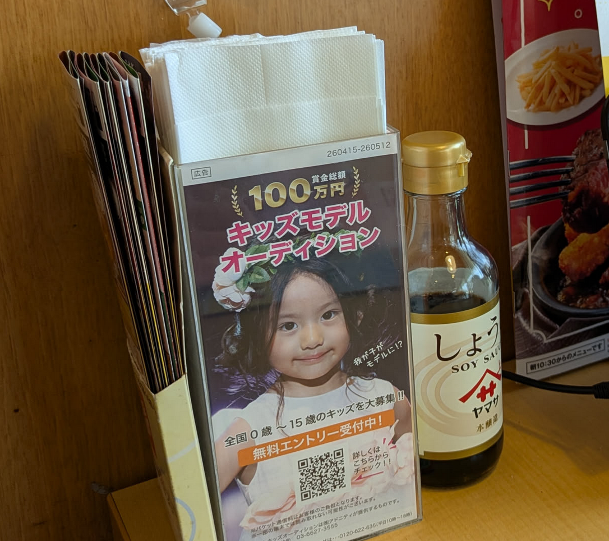
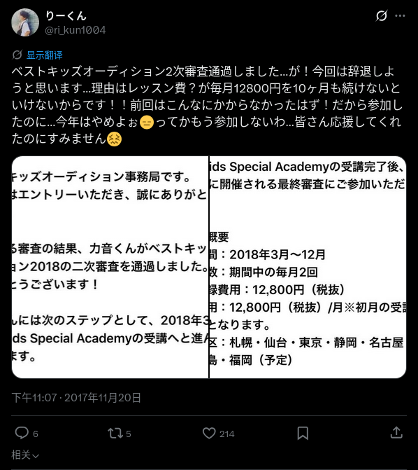

# 日本的“儿童模特”生意

每次去日本的平价家庭餐厅Gusto，都能在放纸巾的盒子上看到儿童模特试镜的商业广告。

我的第一个直觉是这肯定是一门大生意，但是这个生意到底是怎么赚钱的，我暂且蒙在鼓里。

于是简单调查了一下，希望抱有类似想法的家长能够谨慎行事，珍惜自己和孩子的生活费。

## 儿童试镜的千层套路

首先我调查了一下其背后的公司“株式会社アドニティカ (Adnitica) ”，由于没有上市我也看不到财务相关的信息，可以查到的是大约在2013年这家公司就开始活动了。（确实我很早以前就在日本看到这个广告了，只是之前一直忽略了）

简单来说，就是以“免费试镜”为入口，通过后续一系列所谓的“收费服务”来赚钱。完全是利用家长对孩子成名的期待来层层筛选付费用户。这一点不难想到，但是这个局设置之精妙，值得分析。

### 广告投放

首先是投放的地点，Gusto的定位是一家廉价家庭餐馆，物美价廉，平均一人一两千日元就吃的不错了。我最喜欢里面的辣鸡腿肉，炸鸡套餐和最近新出汉堡肉饼（我也不知道这些餐点的中文翻译是什么，随便说说吧）。汉堡肉饼用了炖牛肉的肉汁，不咸但是鲜香浓郁。而且里面还有自助饮料（Drink Bar），只要花一点钱就可以在店里面慢慢看书看手机无限畅饮，总之是我非常喜欢的店。（有点跑题了，这么写下去就是Gusto的软文了）。

总之，这家店的市场定位吸引到了大量的家庭客户。往往是一家人拖家带口的过来吃饭，而且其定价也可以覆盖收入较低的家庭。这就让它的投放十分精准了。无论是居酒屋还是牛肉盖饭店，都不会有这样精准的客户定位。

可能是我去的家庭餐馆还是少了，我只在Gusto见过这个广告。这是我对Gusto唯一印象不太好的事情。

### 软文轰炸

其次就是互联网上的软文轰炸，或者是SEO优化。我随便给一些软文的链接各位可以自行感受一下。

- [ベストキッズオーディション「誰でも受かる」は本当？合格率・費用・評判を徹底解説2026](https://ikujira.com/40248/)
- [ベストキッズオーディションとは？費用・流れ・口コミ・体験談を全網羅](https://tomotin.com/best-kids-audition/)
- [ベストキッズオーディションの口コミ・評判【費用が金儲けの詐欺？】](https://hetori.com/best-kids-audition-reputation/)

这些软文就是比较基础款的软文，假装独立客观第三方，实则大力宣传，字里行间埋入营销链接。

#### 差评软文

还有这种标题起的像是差评但实际上是软文的东西：

- [【評判怪しい？】ベストキッズオーディションを実際に受けた10人の口コミ結果で後悔するか暴露！](https://newarrivals.xsrv.jp/best-kids-audition/)

之所以会写差评型的软文，是为了SEO污染别人发的差评。至少我在用AI调查的时候，它就几乎成功的污染了我的AI。AI说“建议把它看作一个给孩子留下特殊童年纪念的收费项目来做权衡。”其实这就是所谓差评或者其它部分伪装成中立的软文的“家族の思い出に残る大きなイベントを体験させたい”。

#### 真实体验软文

这种软文的设计就更加精细了，比如这一篇：[ベストキッズオーディション、その後（事務所契約〜活動まで）](https://ikukyudad.com/best-kids-audition-2021-02/)

看上去是真实的体验，事实上也应该是真实存在的孩子的照片和信息，但是我还是在页面的异常种找到了蛛丝马迹。

第一我能看到营销链接植入，**文末带有追踪参数的联盟营销链接**，是明确的营利性目的。这是最让我疑心的地方。

其将活动描述为提升家庭体验的“活动”，对负面信息（如“持续落选”）轻描淡写。强调“不花钱”与“无强制课程”，间接洗白外界质疑的商业模式，呼吁“まずは無料エントリー！！”引导用户报名。

### 谁都能过的二次审查

软文中写一次审查90%都能过，但是二次审查的合格率只有10%。
可是，就我看到的情况是，几乎没有看到有人介绍二次审查失败的心得。
[别人的经验](https://detail.chiebukuro.yahoo.co.jp/qa/question_detail/q12233990437)也大多是“几乎人人都能过二次审查”。
倒是很多人通过二次审查以后收到了入会费和每月的费用的请求[开始犹豫要不要继续](https://ameblo.jp/yukikokomi11091016/entry-12355204746.html)。

所谓的10%，只不过是用软文制造心理落差，给家长一种“二次审查都能通过，我的孩子没准真的能行”的感觉。同时，用“没准二次审查过不了呢，试一试也没什么损失”的心态来降低第一次报名的门槛。

### 看不见的沉没成本与获客漏斗

在二次审查前，家长会花，但是不会花很多钱。最多也就是5000~10000日元左右（而且应该是可选的）。但是，圈套在免费时已经设下——家长已经投入的时间金钱或许可以忍耐，孩子付出的时间和精神就难以被家长衡量了，很多家长出于为了不让孩子失望，可能会咬着牙交入会费和每月的费用。

更要命的是费用是逐级加码的，为的就是创造一个漏斗，来过滤掉那些付费意愿不够强烈的家庭。这样可以减少客服的数量，降低运营的成本。

只可惜，家长每多交一笔钱，沉没成本就更多，绑定就更加牢固，以后只会收更多的钱。从每月的1万2,到每月12万，等到意识到这是一个无底洞的时候，恐怕也很难抽身了。

## 二次審査通过后还需要多少钱？

按照[这条推文](https://x.com/ri_kun1004/status/932611396788830208)的说法：

12.8万日元，每月，至少持续10个月，也就是至少128万日元。这哪里是赏金总额100万，这是要倒贴100万啊！

但是我看到更多的信息，10个月总计花费15万左右。

### 二次审查之后提供了什么课程？

比如[这个妈妈](https://qa.mamari.jp/question/16378208) ：

> ### 子供がオーディションに進む中、動画レッスンの料金が高いため辞退しましたが、もったいない気持ちがあります。皆さんの意見をお聞きしたいです。
> 子供2人がベストキッズオーディションの2次審査まで受かり、あとはベストキッズアカデミー（登録料26,000円、月謝12980円×9回）を受け、最終審査を受ける予定でした。
> しかし、ほとんどが通いのレッスンではなくて、動画提供レッスン（送られて来た動画で自主練）5回だけが通いのレッスンです。
> 動画で自主練の割に料金が高いとの理由で旦那に反対され辞退することに。
> でも、私としてはもったいないことをしたんじゃ…？？？とモヤモヤしてしまっています。
> 皆様なら、どう思いますか…？
> 率直な意見、お願いします。

可以看到，所谓的课程，无非是发一些视频给孩子自己练习，成本几乎为0。就这样的课程的成本居然要十几万日元。

## 孩子真的能成为童星吗？

结论是很难，尽管软文里面说“有名人も輩出”，但是我根本就查不到有哪位童星以前是参加过这个竞赛的。

对于[官网提供的名单](https://audition.photoreco.com/bestkids/kidsmodel/record)，我只能查到几个在NHK的剧里面演过配角级别孩子，而且其演艺的职业道路究竟和这个竞赛有无关系也难以论说。

另外一条路是接商单，且不论没有作为艺人的知名度的孩子能接什么商单，以及日后怎么办暂且不说。我也仅仅看到其宣传声称获奖者将有机会参与“フォトスタジオやアパレルブランドのモデル撮影” (摄影工作室和服装品牌的模特拍摄)，但是这也仅仅是针对获奖者而言。

总之，这家公司的营收肯定不是和童星签约，通过售卖造星课程赚钱，赚的是想要望子成星的家长的钱。而课程本身也不过是发送几个视频，所以称之为欺诈也不算过分。

## 公司的营收大约是多少？

老实说，我也不知道。这家公司又没有上市，也没有公开的会计信息。

按照官方的数据，参赛人数去年已经达到了37万，官方的软文声称只有10%的家庭通过二次审查并且继续付费，年营收也可以达到55亿日元左右（估算），而且还可能有个别家庭能贡献100多万。

但是这样估算是不准确的，这家公司的注册资本也只有1000万日元，官方的参赛人数可能会有水分，即使不考虑水分，按照官方的口径，交费率也到不了10%（审查合格不一定缴费）。直觉告诉我每年也不会有那么多人上当。

我在一则软文里看到，决赛一般有3000个孩子参加，最终会有50个孩子胜出，淘汰倍率大约是60倍。如果这个数据是真的，那么收入大约是3000x15万约合4.5亿日元。

这4.5亿日元我猜能有1千万日元用在举办比赛就不错了，最大的开支应该是人工、广告投放（Gusto等等）、互联网软文营销+SEO。

## 中国有类似的商业模式吗？

当然是有的，中国也存在高度相似的商业模式。如果说日本是打着造星的旗号卖所谓培训班，中国的商业模式运作就更像诈骗了。

这是题外话了，具体的可以看下面的链接：

- [26.8万“造星”幻梦， 一场针对家长与孩子的精密收割 ](https://szb.fzshb.cn/fzshb/20260303/html/content_20260303003001.htm)
- [起底童星梦背后产业链陷阱：“试戏”变“卖课”，数万元换一场空](https://www.jsjc.gov.cn/yaowen/202512/t20251224_1181053.shtml)
- [数万元换一场空！起底“童星梦”背后的灰色产业链](https://www.chinanews.com.cn/m/sh/2025/12-31/10543398.shtml)
